## h2 Lempiväri: violetti

Tehtävät ovat Tero Karvisen ja Lari Iso-Anttilan opintojaksolta [Verkkoon tunkeutuminen ja tiedustelu](https://terokarvinen.com/verkkoon-tunkeutuminen-ja-tiedustelu/) [^1].

---

#### Laite jolla tehtävät tehdään:

- Apple MacBook Pro M2 Max
- macOS Sequoia 15.3.2
- Hypervisorina Parallels Desktop

---

### x) 

- Selitä tuskan pyramidin idea 1-2 virkkeellä. [^20]

  - Mitä korkeammalla pyramidissa olla sitä tuskallisempaa tunkeilijalle on tulla blokatuksi.

- Selitä timanttimallin (Diamond Model) idea 1-2 virkkeellä.

  - Diamond mallia käytetään kybertunkeutumisen analysoinnissa. [^21]
  - Timanttimallissa on neljä pääkomponnenttia jotka ovat [^21]
     
    - Vastustaja (hyökkääjä)
    - Infrastruktuuri
    - Mahdollisuudet (vastustajan työkalut, malware, exloitit)
    - Uhri


---

### a) Apache log.

Päätin asentaa Apachen Debian 12 virtuaalikoneelle, jota olen käyttänyt aiemmin. Konella oliko jo apache2 asennettuna, mutta vain default sivulla. Päätin tehdä omat sivut (en muistanut ulkoa kaikkia komentoja, joten käytin Linux palvelimet kurssin muistiinpanojani [^2].

Ensin Teron Linux palvelimet tunnilla antaman ohjeen mukaan ylikirjoitin default sivun.

```
echo default | sudo tee /var/www/html/index.html
```

Tämän jälkeen ajoin seuraavat komennot ja konfiguroinnin:

```
sudoedit /etc/apache2/sites-available/pinkkila.com.conf
```

```
<VirtualHost *:80>
 ServerName pinkkila.com
 ServerAlias www.pinkkila.com
 DocumentRoot /home/parallels/public_sites/pinkkila.com
 <Directory /home/parallels/public_sites/pinkkila.com>
   Require all granted
 </Directory>
</VirtualHost>
```

```
sudo a2ensite pinkkila.com
```

```
sudo a2dissite 000-default.conf
```

```
sudo systemctl restart apache2
```

```
mkdir -p /home/parallels/public_sites/pinkkila.com/
```
```
echo "<h1>Pinkkila</h1>" > /home/parallels/public_sites/pinkkila.com/index.html
```

Sivu toimi:

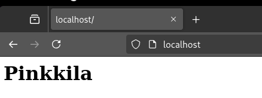

Jatkoin tekemällä sivun johon pääsee linkillä 

```
mkdir -p /home/parallels/public_sites/pinkkila.com/another
```

Ja lisäsin hiukan html ja css.

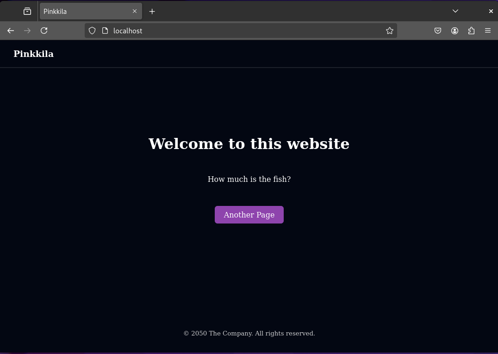

Teron tehtävän sivun ohjeiden [^1] avulla tarkastelin logeja ensin tail komennolla (-F tarkoitaa follow [^3])

```
sudo tail -F /var/log/apache2/access.log
```

Vaikka päivitin sivua selaimen localhost osoitteesta, niin uusia rivejä ei tullut. 

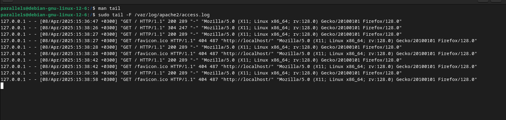

Kokeilin seuraavaksi avata sivut Macin Chromesta, mutta mitään ei tapahtunut. 

Päätin kokeilla ennen enempiä analyysejä, miltä journalctl näyttää. [^4]

```
sudo journalctl -f
```

Päivitin sivua molemmissa Debianin Firefoxissa ja Macin Chromessa ja mitään ei tapahtunut. 


Analysoidaan rivi tässä välissä:

```
127.0.0.1 - - [08/Apr/2025:15:38:58 +0300] "GET / HTTP/1.1" 200 289 "-" "Mozilla/5.0 (X11; Linux x86_64; rv:128.0) Gecko/20100101 Firefox/128.0"
```

- 127.0.0.1  on ip-osoite, mistä pyyntö tuli serverille [^5] 

- [08/Apr/2025:15:38:58 +0300] - aika jolloin pyyntö saapui [^5]

- "GET / HTTP/1.1" - pyyntö oli GET, / path resurssiin, pyynnän protokolla oli HTTP/1.1 [^5]

- 200 - on pyynnön statuskoodi [^5]

- 289 - on palautetun objektin koko (ei sisällä response headeria) [^5]

- "Mozilla/5.0 (X11; Linux x86_64; rv:128.0) Gecko/20100101 Firefox/128.0" - User agent [^5]

Kun mietein miksi logi ei päivity, niin aloin miettiä myös, että miksi kellonaikakin on noin kauan aikaa sitten. Aloin miettiä, oman sivun logi menee varmaankin johonkin muualle tai sitten se pitää erikseen konfiguroida. Menin hieman kömpelösti sudolla katsomaan mitä log hakemistossa on:

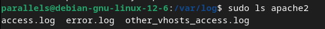

Sitten testasin tuota other_vhosts_access.log ja logit kirjautuivat sinne 

```
sudo tail -F /var/log/apache2/other_vhosts_access.log
```

Näitä logeja kun katsoi niin oli aika ilmestä, että ne aiemmat logit olivat default sivun logit (kts. d tehtävä) 

---

### b) Nmapped. Porttiskannaa oma weppipalvelimesi käyttäen localhost-osoitetta ja 'nmap -A' päällä. Selitä tulokset. (Pelkkä http-portti 80/tcp riittää)

Laitoin Network moden Host Only 

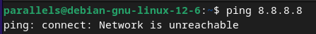

Käytin Karvisen ojeita [^1]

```
sudo nmap -T4 -vv -A -p 80 localhost
```

- -T4 lisää skannausen nopeutta [^6]
- -vv on verbosity level. [^6]
- -A OS detection [^6]

##### Porttiskannouksen tulokset:

```
Scanned at 2025-04-08 18:35:27 EEST for 8s

PORT   STATE SERVICE REASON         VERSION
80/tcp open  http    syn-ack ttl 64 Apache httpd 2.4.62 ((Debian))
| http-methods:
|_  Supported Methods: OPTIONS HEAD GET POST
|_http-server-header: Apache/2.4.62 (Debian)
|_http-title: Pinkkila
```

- 80/tcp open http - Portti 80/tcp:llä on auki ja servicenä on http, jolloin varmastikkin on niin, että http pyynnöllä voi käyttää portin tarjoamaa palvelua
- syn-ack ttl 64 - syn on TCP-protokollan threeway handshakin ensimmäinen pyyntö ja ack on tietämys paketista [^7]. ttl on time to live [^8]
- Apache httpd 2.4.62 ((Debian)) - Apachen versio ja millä pyörii
- http-server-header: Apache/2.4.62 (Debian) - serveri millä ja tajusin vasta nyt, että tämähän on varmaan aina headerina http pyynnöissä.
- http-title on headin titleen laittamani teksti.

```
Warning: OSScan results may be unreliable because we could not find at least 1 open and 1 closed port
Device type: general purpose
Running: Linux 2.6.X
OS CPE: cpe:/o:linux:linux_kernel:2.6.32
OS details: Linux 2.6.32
```
- Näistä tiedoista näkee varmastikkin sen, mikä linux kernel palvelinta pyörittävällä koneella on. 
- 2.6.32 on orginal release date ollut 2 joulukuuta 2009 [^9]
- Lisäksi TCP/IP fingerprintistä näkee, että kone on `aarch64-unknown-linux-gnu)`

```
Uptime guess: 21.033 days (since Tue Mar 18 16:47:57 2025)
Network Distance: 0 hops
TCP Sequence Prediction: Difficulty=261 (Good luck!)
IP ID Sequence Generation: All zeros
```

- Tuo aika on varmastikin se milloin olen asentanut tämän koneen. Aika hurjaa jotenkin, että se näkyy tässä. 
- Network Distancen hop syntyy kun paketti syötetään network segmentistä toiseen [^10]. Tässä se on ilmeisenä tietysti 0, koska kyseessä on localhost.
- TCP Sequence Prediction - Jos ymmärrän nmapin documentaatiosta [^11] oikein tämä on vanhempaan kirjautumistapaan (rlogin) littyvä skannaus, eikä välttämättä ole enää useinkaan haavoittuvuus. Tässä kyseisessä tilanteessa ei haavoittuvuutta ole ja se ilmoitetaan myös kevyellä vitsillä.

---

### c) Skriptit. Mitkä skriptit olivat automaattisesti päällä, kun käytit "-A" parametria? (Näkyy avoimien porttinumeroiden alta, http-blah, http-blöh...).

Varmaankin nämä:

```
|_http-server-header: Apache/2.4.62 (Debian)
|_http-title: Pinkkila
```

---

### d) Jäljet lokissa.

nmap porttiskannauksesta `sudo nmap -T4 -vv -A -p 80 localhost` kirjautuu seuraava loki:

```
pinkkila.com:80 127.0.0.1 - - [08/Apr/2025:20:53:54 +0300] "GET / HTTP/1.0" 200 928 "-" "-"
pinkkila.com:80 127.0.0.1 - - [08/Apr/2025:20:53:56 +0300] "OPTIONS / HTTP/1.1" 200 181 "-" "Mozilla/5.0 (compatible; Nmap Scripting Engine; https://nmap.org/book/nse.html)"
pinkkila.com:80 127.0.0.1 - - [08/Apr/2025:20:53:56 +0300] "GET / HTTP/1.1" 200 928 "-" "Mozilla/5.0 (compatible; Nmap Scripting Engine; https://nmap.org/book/nse.html)"
pinkkila.com:80 127.0.0.1 - - [08/Apr/2025:20:53:56 +0300] "GET /.git/HEAD HTTP/1.1" 404 451 "-" "Mozilla/5.0 (compatible; Nmap Scripting Engine; https://nmap.org/book/nse.html)"
pinkkila.com:80 127.0.0.1 - - [08/Apr/2025:20:53:56 +0300] "PROPFIND / HTTP/1.1" 405 519 "-" "Mozilla/5.0 (compatible; Nmap Scripting Engine; https://nmap.org/book/nse.html)"
pinkkila.com:80 127.0.0.1 - - [08/Apr/2025:20:53:56 +0300] "GET /nmaplowercheck1744134836 HTTP/1.1" 404 451 "-" "Mozilla/5.0 (compatible; Nmap Scripting Engine; https://nmap.org/book/nse.html)"
pinkkila.com:80 127.0.0.1 - - [08/Apr/2025:20:53:56 +0300] "POST / HTTP/1.1" 200 928 "-" "Mozilla/5.0 (compatible; Nmap Scripting Engine; https://nmap.org/book/nse.html)"
pinkkila.com:80 127.0.0.1 - - [08/Apr/2025:20:53:56 +0300] "GET / HTTP/1.0" 200 928 "-" "-"
pinkkila.com:80 127.0.0.1 - - [08/Apr/2025:20:53:56 +0300] "OPTIONS / HTTP/1.1" 200 181 "-" "Mozilla/5.0 (compatible; Nmap Scripting Engine; https://nmap.org/book/nse.html)"
pinkkila.com:80 127.0.0.1 - - [08/Apr/2025:20:53:56 +0300] "PROPFIND / HTTP/1.1" 405 519 "-" "Mozilla/5.0 (compatible; Nmap Scripting Engine; https://nmap.org/book/nse.html)"
pinkkila.com:80 127.0.0.1 - - [08/Apr/2025:20:53:56 +0300] "OPTIONS / HTTP/1.1" 200 181 "-" "Mozilla/5.0 (compatible; Nmap Scripting Engine; https://nmap.org/book/nse.html)"
pinkkila.com:80 127.0.0.1 - - [08/Apr/2025:20:53:56 +0300] "POST /sdk HTTP/1.1" 404 451 "-" "Mozilla/5.0 (compatible; Nmap Scripting Engine; https://nmap.org/book/nse.html)"
pinkkila.com:80 127.0.0.1 - - [08/Apr/2025:20:53:56 +0300] "GET /robots.txt HTTP/1.1" 404 451 "-" "Mozilla/5.0 (compatible; Nmap Scripting Engine; https://nmap.org/book/nse.html)"
pinkkila.com:80 127.0.0.1 - - [08/Apr/2025:20:53:56 +0300] "OPTIONS / HTTP/1.1" 200 181 "-" "Mozilla/5.0 (compatible; Nmap Scripting Engine; https://nmap.org/book/nse.html)"
pinkkila.com:80 127.0.0.1 - - [08/Apr/2025:20:53:56 +0300] "GET /evox/about HTTP/1.1" 404 451 "-" "Mozilla/5.0 (compatible; Nmap Scripting Engine; https://nmap.org/book/nse.html)"
pinkkila.com:80 127.0.0.1 - - [08/Apr/2025:20:53:56 +0300] "MZWQ / HTTP/1.1" 501 494 "-" "Mozilla/5.0 (compatible; Nmap Scripting Engine; https://nmap.org/book/nse.html)"
pinkkila.com:80 127.0.0.1 - - [08/Apr/2025:20:53:56 +0300] "PROPFIND / HTTP/1.1" 405 519 "-" "Mozilla/5.0 (compatible; Nmap Scripting Engine; https://nmap.org/book/nse.html)"
pinkkila.com:80 127.0.0.1 - - [08/Apr/2025:20:53:56 +0300] "GET /HNAP1 HTTP/1.1" 404 451 "-" "Mozilla/5.0 (compatible; Nmap Scripting Engine; https://nmap.org/book/nse.html)"
pinkkila.com:80 127.0.0.1 - - [08/Apr/2025:20:53:56 +0300] "OPTIONS / HTTP/1.1" 200 181 "-" "Mozilla/5.0 (compatible; Nmap Scripting Engine; https://nmap.org/book/nse.html)"
pinkkila.com:80 127.0.0.1 - - [08/Apr/2025:20:53:56 +0300] "GET /favicon.ico HTTP/1.1" 404 451 "-" "Mozilla/5.0 (compatible; Nmap Scripting Engine; https://nmap.org/book/nse.html)"
pinkkila.com:80 127.0.0.1 - - [08/Apr/2025:20:53:56 +0300] "GET / HTTP/1.1" 200 928 "-" "Mozilla/5.0 (compatible; Nmap Scripting Engine; https://nmap.org/book/nse.html)"
pinkkila.com:80 127.0.0.1 - - [08/Apr/2025:20:53:56 +0300] "OPTIONS / HTTP/1.1" 200 181 "-" "Mozilla/5.0 (compatible; Nmap Scripting Engine; https://nmap.org/book/nse.html)"
pinkkila.com:80 127.0.0.1 - - [08/Apr/2025:20:53:56 +0300] "OPTIONS / HTTP/1.1" 200 181 "-" "Mozilla/5.0 (compatible; Nmap Scripting Engine; https://nmap.org/book/nse.html)"
pinkkila.com:80 127.0.0.1 - - [08/Apr/2025:20:53:56 +0300] "OPTIONS / HTTP/1.1" 200 181 "-" "Mozilla/5.0 (compatible; Nmap Scripting Engine; https://nmap.org/book/nse.html)"
pinkkila.com:80 127.0.0.1 - - [08/Apr/2025:20:53:56 +0300] "OPTIONS / HTTP/1.1" 200 181 "-" "Mozilla/5.0 (compatible; Nmap Scripting Engine; https://nmap.org/book/nse.html)"
pinkkila.com:80 127.0.0.1 - - [08/Apr/2025:20:53:56 +0300] "OPTIONS / HTTP/1.1" 200 181 "-" "Mozilla/5.0 (compatible; Nmap Scripting Engine; https://nmap.org/book/nse.html)"
pinkkila.com:80 127.0.0.1 - - [08/Apr/2025:20:53:56 +0300] "OPTIONS / HTTP/1.1" 200 181 "-" "Mozilla/5.0 (compatible; Nmap Scripting Engine; https://nmap.org/book/nse.html)"
pinkkila.com:80 127.0.0.1 - - [08/Apr/2025:20:53:56 +0300] "GET / HTTP/1.0" 200 928 "-" "-"
pinkkila.com:80 127.0.0.1 - - [08/Apr/2025:20:53:56 +0300] "GET / HTTP/1.1" 200 909 "-" "-"
```

Ensimmäisessä, seitsemännessä ja kahdessa viimeisessä GET pyynnössä ei ole User Agentia ollenkaan. 

Kaikissa muissa pyynnöissä User Agentina on "Mozilla/5.0 (compatible; Nmap Scripting Engine; https:\//nmap.org/book/nse.html"

Neljännessä pyynnössä oleva .git/HEAD ilmeisesti tarkistaa onko kohteessa git versionhallintaa [^12].

Kuudennessa pyynnössä oleva nmaplowercheck ja sen perässä oleva numero on epoch time string ja kokonaisuudessan nmaplowercheck epoch ajalla tarkistaa ilmaisesti URL:ää 404 vastaukselle [^13].

PROPFIND on ilmeisesti joku vanhempi pyyntö, joka ei enää ole ylläpidossa [^13], mutta on käytetty XML propertien pyytämiseen. 

Rivillä kaksitoista nmap lähettä POST pyynnön osoitteeseen /sdk, googlaamaalla yleisesti en löytänyt muuta kuin, että olisko sdk tässä software development kit. En ole yhtään varma, pikemminkin arvaus.

En myöskään löytänyt hyvää tietoja /evox/about

/HNAP1 tekee ilmeisesti jonkinlaisen tarkistuksen, että onko kysessä Ciscon laitteiden käyttämä protocolla [^13]

###### Millaisilla hauilla tai säännöillä voisit tunnistaa porttiskannauksen jostain muusta lokista, jos se on niin laaja, että et pysty lukemaan itse kaikkia rivejä?

grep -i niin ignore case [^14]

```
sudo tail /var/log/apache2/other_vhosts_access.log |grep -i "nmap" 
```
---

### e) Wire sharking. Sieppaa verkkoliikenne porttiskannatessa Wiresharkilla..

Käytin filtteriä `frame contains "nmap"` [^15]

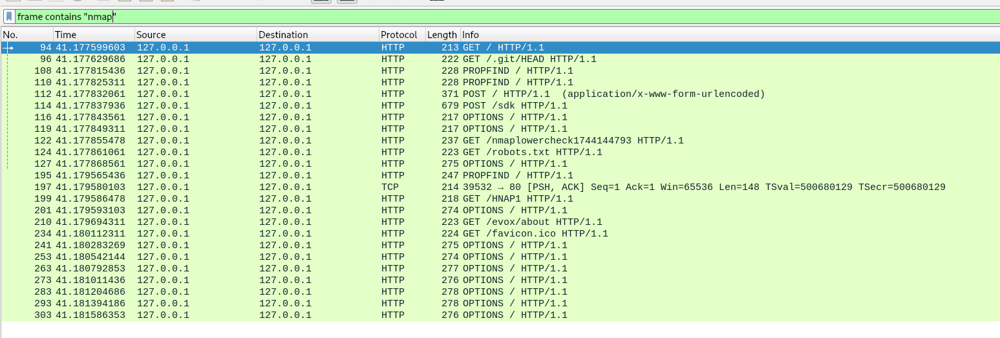

- Taitaa kaikissa Source Port olla 39466
- POST / on formin lähetys [^16]
- POST /sdk paylodina on pitkä string, jossa ei ole mitään ihmiselle luettavaa

---

Karvisen ohjeen mukaan käytin [^1]

```
sudo ngrep -d lo -i nmap
```
- -d - dev [^17]
- lo - varmastikkin localhostin interfce
- -i - ignore case for regex expression [^17]

```
parallels@debian-gnu-linux-12-6:~$ sudo ngrep -d lo -i nmap
interface: lo (127.0.0.0/255.0.0.0)
filter: ((ip || ip6) || (vlan && (ip || ip6)))
match (JIT): nmap
#############################################################################################
T 127.0.0.1:55992 -> 127.0.0.1:80 [AP] #93
  OPTIONS / HTTP/1.1..Access-Control-Request-Method: HEAD..Host: localhost..Origin: example.com..Connection: close..User-Agent: Mozilla/5.0 (compatible; Nmap Scr
  ipting Engine; https://nmap.org/book/nse.html)....                                                                                                             
#####
T 127.0.0.1:56000 -> 127.0.0.1:80 [AP] #98
  OPTIONS / HTTP/1.1..Connection: close..User-Agent: Mozilla/5.0 (compatible; Nmap Scripting Engine; https://nmap.org/book/nse.html)..Host: localhost....        
##
T 127.0.0.1:56006 -> 127.0.0.1:80 [AP] #100
  POST /sdk HTTP/1.1..Host: localhost..Connection: close..User-Agent: Mozilla/5.0 (compatible; Nmap Scripting Engine; https://nmap.org/book/nse.html)..Content-Le
  ngth: 441....<soap:Envelope xmlns:xsd="http://www.w3.org/2001/XMLSchema" xmlns:xsi="http://www.w3.org/2001/XMLSchema-instance" xmlns:soap="http://schemas.xmlso
  ap.org/soap/envelope/"><soap:Header><operationID>00000001-00000001</operationID></soap:Header><soap:Body><RetrieveServiceContent xmlns="urn:internalvim25"><_th
  is xsi:type="ManagedObjectReference" type="ServiceInstance">ServiceInstance</_this></RetrieveServiceContent></soap:Body></soap:Envelope>                       
##########
T 127.0.0.1:56008 -> 127.0.0.1:80 [AP] #110
  GET / HTTP/1.1..Connection: close..User-Agent: Mozilla/5.0 (compatible; Nmap Scripting Engine; https://nmap.org/book/nse.html)..Host: localhost....            
##
T 127.0.0.1:56020 -> 127.0.0.1:80 [AP] #112
  OPTIONS / HTTP/1.1..Connection: close..User-Agent: Mozilla/5.0 (compatible; Nmap Scripting Engine; https://nmap.org/book/nse.html)..Host: localhost....        
##
T 127.0.0.1:56030 -> 127.0.0.1:80 [AP] #114
  PROPFIND / HTTP/1.1..User-Agent: Mozilla/5.0 (compatible; Nmap Scripting Engine; https://nmap.org/book/nse.html)..Connection: close..Depth: 0..Host: localhost.
  ...                                                                                                                                                            
##
T 127.0.0.1:56032 -> 127.0.0.1:80 [AP] #116
  GET /robots.txt HTTP/1.1..Connection: close..User-Agent: Mozilla/5.0 (compatible; Nmap Scripting Engine; https://nmap.org/book/nse.html)..Host: localhost....  
###################
T 127.0.0.1:56064 -> 127.0.0.1:80 [AP] #135
  POST / HTTP/1.1..Content-Type: application/x-www-form-urlencoded..User-Agent: Mozilla/5.0 (compatible; Nmap Scripting Engine; https://nmap.org/book/nse.html)..
  Host: localhost..Connection: close..Content-Length: 88....<methodCall> <methodName>system.listMethods</methodName> <params></params> </methodCall>             
##
T 127.0.0.1:56068 -> 127.0.0.1:80 [AP] #137
  GET /nmaplowercheck1744148250 HTTP/1.1..Connection: close..User-Agent: Mozilla/5.0 (compatible; Nmap Scripting Engine; https://nmap.org/book/nse.html)..Host: l
  ocalhost....                                                                                                                                                   
##
T 127.0.0.1:56082 -> 127.0.0.1:80 [AP] #139
  GET /.git/HEAD HTTP/1.1..Connection: close..User-Agent: Mozilla/5.0 (compatible; Nmap Scripting Engine; https://nmap.org/book/nse.html)..Host: localhost....   
##
T 127.0.0.1:56086 -> 127.0.0.1:80 [AP] #141
  PROPFIND / HTTP/1.1..User-Agent: Mozilla/5.0 (compatible; Nmap Scripting Engine; https://nmap.org/book/nse.html)..Connection: close..Depth: 0..Host: localhost.
  ...                                                                                                                                                            
########################################################
T 127.0.0.1:56094 -> 127.0.0.1:80 [AP] #197
  OPTIONS / HTTP/1.1..Access-Control-Request-Method: GET..Host: localhost..Origin: example.com..Connection: close..User-Agent: Mozilla/5.0 (compatible; Nmap Scri
  pting Engine; https://nmap.org/book/nse.html)....                                                                                                              
##
T 127.0.0.1:56102 -> 127.0.0.1:80 [AP] #199
  LMBD / HTTP/1.1..Connection: close..User-Agent: Mozilla/5.0 (compatible; Nmap Scripting Engine; https://nmap.org/book/nse.html)..Host: localhost....           
##
T 127.0.0.1:56106 -> 127.0.0.1:80 [AP] #201
  PROPFIND / HTTP/1.1..Host: localhost..Depth: 1..Connection: close..User-Agent: Mozilla/5.0 (compatible; Nmap Scripting Engine; https://nmap.org/book/nse.html).
  .Content-Length: 0....                                                                                                                                         
##
T 127.0.0.1:56116 -> 127.0.0.1:80 [AP] #203
  GET /HNAP1 HTTP/1.1..Connection: close..User-Agent: Mozilla/5.0 (compatible; Nmap Scripting Engine; https://nmap.org/book/nse.html)..Host: localhost....       
##############
T 127.0.0.1:56130 -> 127.0.0.1:80 [AP] #217
  GET /favicon.ico HTTP/1.1..Connection: close..User-Agent: Mozilla/5.0 (compatible; Nmap Scripting Engine; https://nmap.org/book/nse.html)..Host: localhost.... 
##
T 127.0.0.1:56134 -> 127.0.0.1:80 [AP] #219
  GET /evox/about HTTP/1.1..Connection: close..User-Agent: Mozilla/5.0 (compatible; Nmap Scripting Engine; https://nmap.org/book/nse.html)..Host: localhost....  
##########################
T 127.0.0.1:56148 -> 127.0.0.1:80 [AP] #245
  OPTIONS / HTTP/1.1..Access-Control-Request-Method: POST..Host: localhost..Origin: example.com..Connection: close..User-Agent: Mozilla/5.0 (compatible; Nmap Scr
  ipting Engine; https://nmap.org/book/nse.html)....                                                                                                             
##
T 127.0.0.1:56158 -> 127.0.0.1:80 [AP] #247
  GET / HTTP/1.1..Connection: close..User-Agent: Mozilla/5.0 (compatible; Nmap Scripting Engine; https://nmap.org/book/nse.html)..Host: localhost....            
###############
T 127.0.0.1:56174 -> 127.0.0.1:80 [AP] #262
  OPTIONS / HTTP/1.1..Access-Control-Request-Method: PUT..Host: localhost..Origin: example.com..Connection: close..User-Agent: Mozilla/5.0 (compatible; Nmap Scri
  pting Engine; https://nmap.org/book/nse.html)....                                                                                                              
##########
T 127.0.0.1:56188 -> 127.0.0.1:80 [AP] #272
  OPTIONS / HTTP/1.1..Access-Control-Request-Method: DELETE..Host: localhost..Origin: example.com..Connection: close..User-Agent: Mozilla/5.0 (compatible; Nmap S
  cripting Engine; https://nmap.org/book/nse.html)....                                                                                                           
##########
T 127.0.0.1:56192 -> 127.0.0.1:80 [AP] #282
  OPTIONS / HTTP/1.1..Access-Control-Request-Method: TRACE..Host: localhost..Origin: example.com..Connection: close..User-Agent: Mozilla/5.0 (compatible; Nmap Sc
  ripting Engine; https://nmap.org/book/nse.html)....                                                                                                            
##########
T 127.0.0.1:56198 -> 127.0.0.1:80 [AP] #292
  OPTIONS / HTTP/1.1..Access-Control-Request-Method: OPTIONS..Host: localhost..Origin: example.com..Connection: close..User-Agent: Mozilla/5.0 (compatible; Nmap 
  Scripting Engine; https://nmap.org/book/nse.html)....                                                                                                          
##########
T 127.0.0.1:56206 -> 127.0.0.1:80 [AP] #302
  OPTIONS / HTTP/1.1..Access-Control-Request-Method: CONNECT..Host: localhost..Origin: example.com..Connection: close..User-Agent: Mozilla/5.0 (compatible; Nmap 
  Scripting Engine; https://nmap.org/book/nse.html)....                                                                                                          
##########
T 127.0.0.1:56214 -> 127.0.0.1:80 [AP] #312
  OPTIONS / HTTP/1.1..Access-Control-Request-Method: PATCH..Host: localhost..Origin: example.com..Connection: close..User-Agent: Mozilla/5.0 (compatible; Nmap Sc
  ripting Engine; https://nmap.org/book/nse.html)....                                                                                                            
##########################^Cexit
338 received, 25 matched

```
---

### g) Agentti. Vaihda nmap:n user-agent niin, että se näyttää tavalliselta weppiselaimelta.

Karvisen ohejeilla [^1] muutin nmap komentoa:

```
sudo nmap -T4 -vv -A -p 80 localhost --script-args http.useragent="Mozilla/5.0 (X11; Linux x86_64; rv:128.0) Gecko/20100101 Firefox/128.0"
```

Seuraavassa tehtävässä nähdään toimiiko.

---

### h) Pienemmät jäljet.

Laitoin ensin ngrepin päälle ja ainoastaan tämä jäi haaviin.

```
parallels@debian-gnu-linux-12-6:~$ sudo ngrep -d lo -i nmap
[sudo] password for parallels: 
interface: lo (127.0.0.0/255.0.0.0)
filter: ((ip || ip6) || (vlan && (ip || ip6)))
match (JIT): nmap
#################################################################################################
T 127.0.0.1:39398 -> 127.0.0.1:80 [AP] #97
  GET /nmaplowercheck1744149252 HTTP/1.1..Connection: close..Host: localhost..User-Agent: Mozilla/5.0 (X11; Linux x86_64; rv:128.0) Gecko/20100101 Firefox/128.0.
  ...                                                                                                                                                            
##################################################################################################
```

Sitten kokeilin Wireshakilla ja ei ehkä niin yllättäen sama tilanne. 

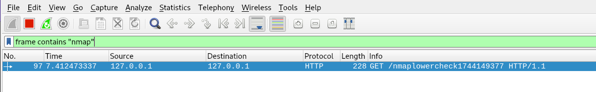

Apachen logeissa näytti tältä:

Tarkastin lokit komennolla:

```
sudo tail /var/log/apache2/other_vhosts_access.log |grep -i "nmap" 
```

Mitään ei suodattunut läpi, mutta en tiedä kuinka paljastavaa tai humiota herättävää on se, että osassa GET pyynnöissä ei ole User Agentia ollenkaan. Lisäksi iso ryösähdys hetkessä tulevia pyyntöjä samasta osoitteesta on ehkä epäilyttävää. Alla muutama pyyntö logeista ilman grepiä.

```
pinkkila.com:80 127.0.0.1 - - [09/Apr/2025:00:56:17 +0300] "OPTIONS / HTTP/1.1" 200 181 "-" "Mozilla/5.0 (X11; Linux x86_64; rv:128.0) Gecko/20100101 Firefox/128.0"
pinkkila.com:80 127.0.0.1 - - [09/Apr/2025:00:56:17 +0300] "OPTIONS / HTTP/1.1" 200 181 "-" "Mozilla/5.0 (X11; Linux x86_64; rv:128.0) Gecko/20100101 Firefox/128.0"
pinkkila.com:80 127.0.0.1 - - [09/Apr/2025:00:56:17 +0300] "GET / HTTP/1.0" 200 928 "-" "-"
pinkkila.com:80 127.0.0.1 - - [09/Apr/2025:00:56:17 +0300] "GET / HTTP/1.1" 200 909 "-" "-"
```

---

### i) Hieman vaikeampi: LoWeR ChEcK.

Karvisen ohjeiden mukaan [^1] menin etsimään oikeaa scriptä seuraavalla komennolla:

```
parallels@debian-gnu-linux-12-6:/usr/share/nmap$ ls | grep -ir "nmaplowercheck"
nselib/http.lua:  local URL_404_1 = '/nmaplowercheck' .. os.time(os.date('*t'))
```

```
sudoedit /usr/share/nmap/nselib/http.lua
```

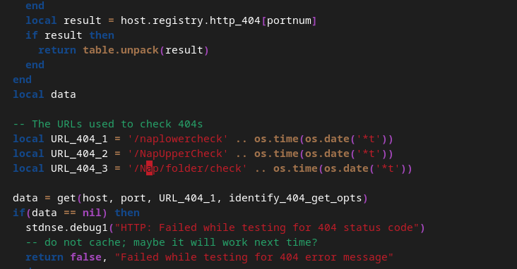 

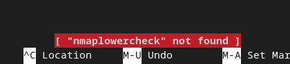


Ja seuraavaksi kokeilin ngrepillä, Wiresharkilla ja katsoin logit ja kaikki olivat tyhjiä.

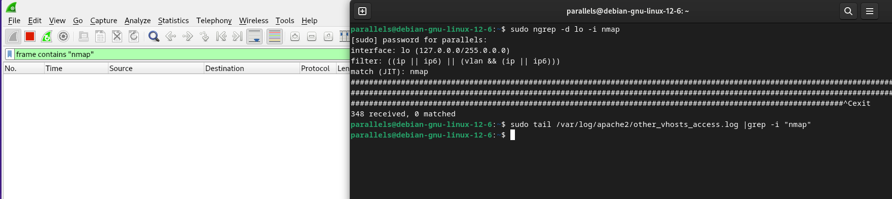

naplowercheck löytyi:

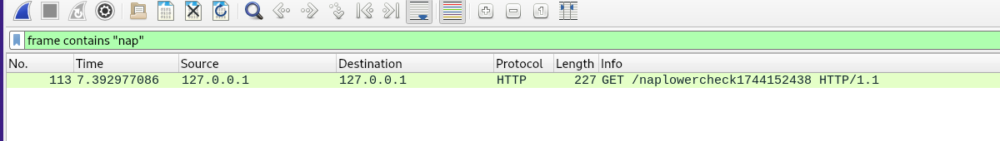

---

### j) Vapaaehtoinen, vaikea: Invisible, invincible. Etsi jokin toinen nmap:n skripti, jonka verkkoliikenteessä esiintyy merkkijono "nmap" isolla tai pienellä.

Käytin apuna Staakin toista kirjoitusta nmapista, jonka mukaan RDS skannauksen aikana nmap tekee cookien, jonka valuena on "nmap" [^18].

Kokeilin RDS skannausta

```
nmap -p 3389 --script rdp-enum-encryption localhost
```

mutta cookieta ei tullut. Arvailin, että cookies ei tule lähetetyksi, koska portissa ei ole mitään. Googlailun jälkeen asensin xrdp:n [^19] 

```
sudo apt-get install xrdp
```

Nyt nmap lähetti cookien

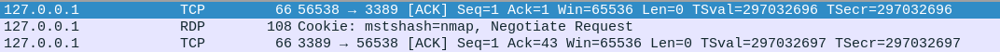

Staakin ohjeilla [^18] etsein /usr/share/nmap/nselib/rdp.lua oikean kohdan:

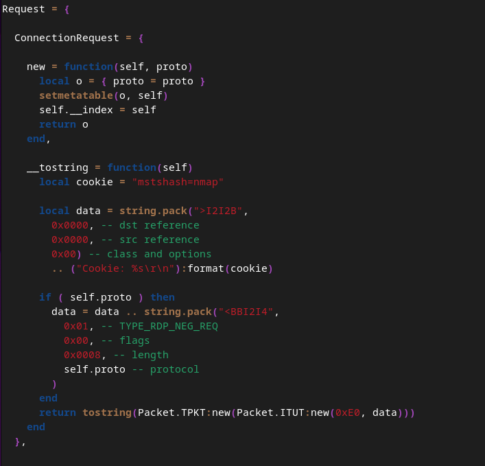

ja muutin nimen ja... koodi oli rikki.

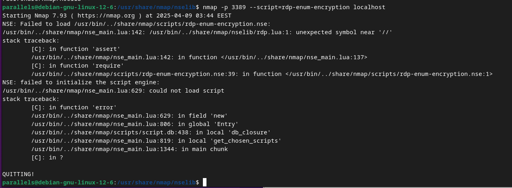

Muutin cookien arvon takaisin nmap, mutta error säilyi. En ole ikinä kirjoittanut Luaa, enkä tunne sen syntaxia, joten avasin toisella virtuaalikoneella saman filen. Olin tehnyt typon kun etsin nanolla "nmap" (// ei kuulu tuohon)(kannataisi varmaan asentaa vs code tai jotain).

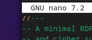

Vaihdoin cookien valueksi nap

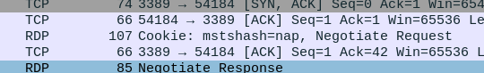

---

## Lähteet

[^1]: Tero Karvinen. Verkkoon tunkeutuminen ja tiedustelu: https://terokarvinen.com/verkkoon-tunkeutuminen-ja-tiedustelu/

[^2]: pinkkila. tehtava-h4: https://github.com/pinkkila/linux-course/blob/main/tehtava-h4.md#c-asenna-weppipalvelin-omalle-virtuaalipalvelimellesi-korvaa-testisivu-kokeile-että-se-näkyy-julkisesti-kokeile-myös-eri-koneelta-esim-kännykältä-jos-haluat-tehdä-oikeat-weppisivut-tarvitset-name-based-virtual-hostin

[^3]: man tail

[^4]: man jourlanctl

[^5]: The Apache Software Foundation. Log files: https://httpd.apache.org/docs/current/logs.html

[^6]: Santos et al. The Art of Hacking (Video Collection):
https://learning.oreilly.com/videos/the-art-of/9780135767849/9780135767849-SPTT_04_00/

[^7]: Master OccupytheWeb 2023. Network Basics for Hackers: How Networks Work and How They Break.https://www.amazon.com/Network-Basics-Hackers-Networks-Break/dp/B0BS3GZ1R9.

[^8]: nmap.org Chapter 18. Nping Reference Guide: https://nmap.org/book/nping-man.html

[^9]: Wikipedia. Linux kernel version history: https://en.wikipedia.org/wiki/Linux_kernel_version_history

[^10]: Wikipedia. Hop (networking): https://en.wikipedia.org/wiki/Hop_(networking)

[^11]: nmap.org. Usage and Examples: https://nmap.org/book/osdetect-usage.html

[^12]: nmap.org. Script http-git: https://nmap.org/nsedoc/scripts/http-git.html

[^13]: Bob van der Staak. Evading Detection while using nmap: https://infosecwriteups.com/evading-detection-while-using-nmap-69633df091f3

[^14]: man grep

[^15]: Tero Karvinen. Wireshark - Getting Started: https://terokarvinen.com/wireshark-getting-started/?fromSearch=wireshark

[^16]: mdn web docs. POST: https://developer.mozilla.org/en-US/docs/Web/HTTP/Reference/Methods/POST

[^17]: man ngrep

[^18]: Bob van der Staak. Evading Detection With Nmap Part 2: https://infosecwriteups.com/evading-detection-with-nmap-part-2-7b4861f1377a

[^19]: Sara Zivanov. How to Enable RDP Using xrdp on Ubuntu: https://phoenixnap.com/kb/xrdp-ubuntu

[^20]: David J Bianco. The Pyramid of Pain: https://detect-respond.blogspot.com/2013/03/the-pyramid-of-pain.html

[^21]: David Tidmarsh. Diamond Model of Intrusion Analysis: What, Why, and How to Learn: https://www.eccouncil.org/cybersecurity-exchange/ethical-hacking/diamond-model-intrusion-analysis/