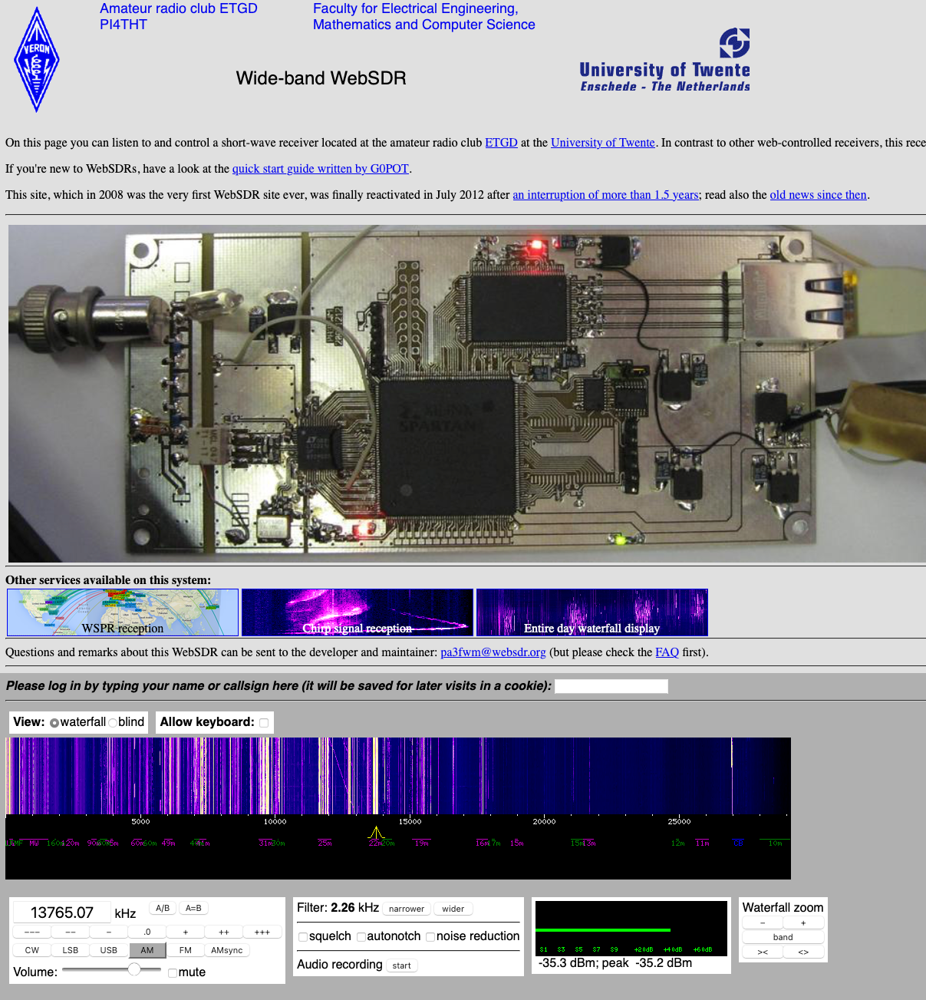
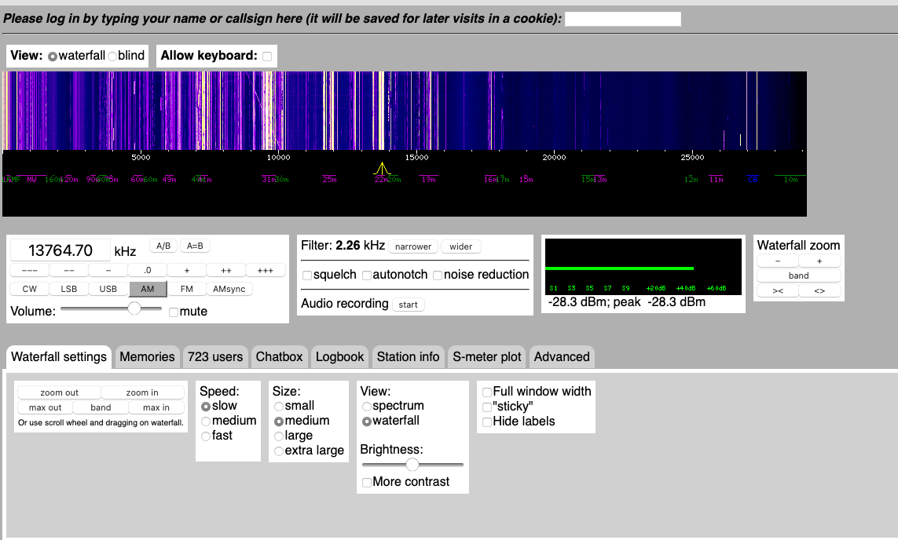

## h3 Aaltoja harjaamassa

Tehtävät ovat Tero Karvisen ja Lari Iso-Anttilan opintojaksolta [Verkkoon tunkeutuminen ja tiedustelu](https://terokarvinen.com/verkkoon-tunkeutuminen-ja-tiedustelu/) [^1].

---

#### Laite jolla tehtävät tehdään:

- Apple MacBook Pro M2 Max
- macOS Sequoia 15.3.2
- Parallels Desktop

---

### x) Lue ja tiivistä.

- Hubacek 2019: Universal Radio Hacker SDR Tutorial on 433 MHz radio plugs, YouTube kanava hubmartin [^13]

    - Videolla hubmartin skannaa ja tallentaa kotielektroniikkalähettimestä signaalia Universal Radio Hackerilla.
    - kun urh:lla maalaa signaali alueen, pitäisi pituuden olla suurinpiirtein yhtä pitkä kuin bit length.
    - messageiden tai skannattujen aaltojen arvojen olisi ilmeisesti hyvä olla samanlaisia keskenään.
    - Bith Length ja Error Tolerance tulisi säädellä sopivaksi.

- Cornelius 2022: Decode 433.92 MHz weather station data [^14]

    - basic carrier päälle ja pois on digitaalinen muoto amplitudi modulaatiosta (AM) ja sitä kutsutaan amplitude shift key:ksi kun carrierilla voi olla vähintään yksi fixed amplitude aalto. 
    - Bits/Symbols, joka on Corneliuksen (ja minun urh:ssa) tulisi Corneliuksen mukaan olla symbols per bit, joka on varmaankin arvo mitä hubmartin videollaan sääti.


---


### a) WebSDR. Etäkäytä WebSDR-ohjelmaradiota, joka on kaukana sinusta ja kuuntele radioliikennettä.

Avasin websdr.org nettisivun [^2] ja valitsin ensimmäisen:


Valitsin linkin ja seuraavaksi olin tässä näkymässä [^3]:



##### Kerro löytämäsi taajuus, aallonpituus ja modulaatio.



Löysin taajuuden, jossa selkeästi puhuttiin englanniksi (britti aksentilla) politiikasta. Välillä tuli mainoksia, joten kyseessä oli varmastikkin kaupallinen kanava. 

- Taajuus: 13764.70 kHz
- Aallonpituus: 21.77980326 m [^5]
- Modulaatio: amplitudimodulaation (AM) [^4]

Aallonpituuden voisi laskea myös itse laskemalla 299,792,458 m/s / 13764700 Hz

---

### b) rtl_433. Asenna rtl_433 automaattista analyysia varten.

Kokeilin Karvisen sivun ohjeilla [^1] ja lopulta päädyin rtl_433 GitHub sivuille [^6] ja huomasin, että komento ohjelman nimi onkin paketinhallinnassa -:lla. 

```
sudo apt-get install rtl-433
```

```
┌──(parallels㉿kali-linux-2024-2)-[~]
└─$ rtl_433  
rtl_433 version 25.02 (2025-02-19) inputs file rtl_tcp RTL-SDR SoapySDR
[SDR] No supported devices found.
```

---

### c) Automaattinen analyysi. Mitä tässä näytteessä tapahtuu? Mitä tunnisteita (id yms) löydät?

Karvisen sivun ohjeilla [^1] ajoin komennon

- -r - datan lukeminen input tiedostosta vastaanottimen sijaan [^7]

```
rtl_433 -r Converted_433.92M_2000k.cs8
```

```bash
┌──(parallels㉿kali-linux-2024-2)-[~/Documents/radio]
└─$ rtl_433 -r Converted_433.92M_2000k.cs8
rtl_433 version 25.02 (2025-02-19) inputs file rtl_tcp RTL-SDR SoapySDR
[Input] Test mode active. Reading samples from file: Converted_433.92M_2000k.cs8
_ _ _ _ _ _ _ _ _ _ _ _ _ _ _ _ _ _ _ _ _ _ _ _ _ _ _ _ _ _ _ _ _ _ _ _ _ _ _ _ _ _ _ _ _ _ _ _ _ _ _ _ _ _
time      : @0.083284s                                                                                      
model     : KlikAanKlikUit-Switch                  id        : 8785315
Unit      : 0            Group Call: No            Command   : Off           Dim       : No
Dim Value : 0
_ _ _ _ _ _ _ _ _ _ _ _ _ _ _ _ _ _ _ _ _ _ _ _ _ _ _ _ _ _ _ _ _ _ _ _ _ _ _ _ _ _ _ _ _ _ _ _ _ _ _ _ _ _
time      : @0.083284s                                                                                      
model     : Proove-Security                        House Code: 8785315
Channel   : 3            State     : OFF           Unit      : 3             Group     : 0
_ _ _ _ _ _ _ _ _ _ _ _ _ _ _ _ _ _ _ _ _ _ _ _ _ _ _ _ _ _ _ _ _ _ _ _ _ _ _ _ _ _ _ _ _ _ _ _ _ _ _ _ _ _
time      : @0.083284s                                                                                      
model     : Nexa-Security House Code: 8785315
Channel   : 3            State     : OFF           Unit      : 3             Group     : 0
_ _ _ _ _ _ _ _ _ _ _ _ _ _ _ _ _ _ _ _ _ _ _ _ _ _ _ _ _ _ _ _ _ _ _ _ _ _ _ _ _ _ _ _ _ _ _ _ _ _ _ _ _ _
time      : @0.163125s                                                                                      
model     : KlikAanKlikUit-Switch                  id        : 8785315
Unit      : 0            Group Call: No            Command   : Off           Dim       : No
Dim Value : 0
_ _ _ _ _ _ _ _ _ _ _ _ _ _ _ _ _ _ _ _ _ _ _ _ _ _ _ _ _ _ _ _ _ _ _ _ _ _ _ _ _ _ _ _ _ _ _ _ _ _ _ _ _ _
time      : @0.163125s                                                                                      
model     : Proove-Security                        House Code: 8785315
Channel   : 3            State     : OFF           Unit      : 3             Group     : 0
_ _ _ _ _ _ _ _ _ _ _ _ _ _ _ _ _ _ _ _ _ _ _ _ _ _ _ _ _ _ _ _ _ _ _ _ _ _ _ _ _ _ _ _ _ _ _ _ _ _ _ _ _ _
time      : @0.163125s                                                                                      
model     : Nexa-Security House Code: 8785315
Channel   : 3            State     : OFF           Unit      : 3             Group     : 0
_ _ _ _ _ _ _ _ _ _ _ _ _ _ _ _ _ _ _ _ _ _ _ _ _ _ _ _ _ _ _ _ _ _ _ _ _ _ _ _ _ _ _ _ _ _ _ _ _ _ _ _ _ _
time      : @0.242956s                                                                                      
model     : KlikAanKlikUit-Switch                  id        : 8785315
Unit      : 0            Group Call: No            Command   : Off           Dim       : No
Dim Value : 0
_ _ _ _ _ _ _ _ _ _ _ _ _ _ _ _ _ _ _ _ _ _ _ _ _ _ _ _ _ _ _ _ _ _ _ _ _ _ _ _ _ _ _ _ _ _ _ _ _ _ _ _ _ _
time      : @0.242956s                                                                                      
model     : Proove-Security                        House Code: 8785315
Channel   : 3            State     : OFF           Unit      : 3             Group     : 0
_ _ _ _ _ _ _ _ _ _ _ _ _ _ _ _ _ _ _ _ _ _ _ _ _ _ _ _ _ _ _ _ _ _ _ _ _ _ _ _ _ _ _ _ _ _ _ _ _ _ _ _ _ _
time      : @0.242956s                                                                                      
model     : Nexa-Security House Code: 8785315
Channel   : 3            State     : OFF           Unit      : 3             Group     : 0
_ _ _ _ _ _ _ _ _ _ _ _ _ _ _ _ _ _ _ _ _ _ _ _ _ _ _ _ _ _ _ _ _ _ _ _ _ _ _ _ _ _ _ _ _ _ _ _ _ _ _ _ _ _
time      : @0.383568s                                                                                      
model     : KlikAanKlikUit-Switch                  id        : 8785315
Unit      : 0            Group Call: No            Command   : Off           Dim       : No
Dim Value : 0
_ _ _ _ _ _ _ _ _ _ _ _ _ _ _ _ _ _ _ _ _ _ _ _ _ _ _ _ _ _ _ _ _ _ _ _ _ _ _ _ _ _ _ _ _ _ _ _ _ _ _ _ _ _
time      : @0.383568s                                                                                      
model     : Proove-Security                        House Code: 8785315
Channel   : 3            State     : OFF           Unit      : 3             Group     : 0
_ _ _ _ _ _ _ _ _ _ _ _ _ _ _ _ _ _ _ _ _ _ _ _ _ _ _ _ _ _ _ _ _ _ _ _ _ _ _ _ _ _ _ _ _ _ _ _ _ _ _ _ _ _
time      : @0.383568s                                                                                      
model     : Nexa-Security House Code: 8785315
Channel   : 3            State     : OFF           Unit      : 3             Group     : 0
                                                                                                            
```

Tunnisteet jotka löydän ovat: 

- aika (time)
- malli (model
- kanava (channel)
- yksikkö (unit)
- dim arvo (dim value)

Aika kasvaa kolmen ryppäissä.

Malli vaihtuu myös kolmen ryppäisssä tai se menee toistuvaa kiertoa, jossa on KlikAanKlikUit-Switch, Proove-Security ja Nexa-Security. KlikAanKlikUit-Switch on id: 8785315, kun taas molemmilla Securityillä on House Code, joka on sama kuin KlikAanKlikUit-Switch id. 

Kanava on KlikAanKlikUit-Switch:llä 0 ja molemmilla Securityillä se on 3 ja lisäski Securityillä on State: Off Unit: 3 ja Group 0

Ainoastaan KlikAanKlikUit-Switch on Unit, jolla on joka kerralla samat arvot: 0, Group Call: no, Command: Off, Dim: No

Ainoastaan KlikAanKlikUit-Switch:llä on dim value ja sen on jokakerta 0. 

Googlaamalla löytyy, että KlikAanKlikUit-Switch tekee ainakin valojen katkaisimia. [^8]

---

### d) Too compex 16? Olet nauhoittanut näytteen 'urh' -ohjelmalla .complex16s-muodossa. Muunna näyte rtl_433-yhteensopivaan muotoon ja analysoi se.

Kokeilin ensin rtl_433 dockista [^9] lukemani perusteella seuraavaa komentoa, mutta se ei toiminut. 

```bash
┌──(parallels㉿kali-linux-2024-2)-[~/Documents/radio]
└─$ rtl_433 Recorded-HackRF-20250411_183354-433_92MHz-2MSps-2MHz.complex16s Converttest_433.92M_2000k.cs8
rtl_433 version 25.02 (2025-02-19) inputs file rtl_tcp RTL-SDR SoapySDR
[Input] Test mode active. Reading samples from file: Recorded-HackRF-20250411_183354-433_92MHz-2MSps-2MHz.complex16s
[Input] Opening file "Converttest_433.92M_2000k.cs8" failed!
```

Karvisen tehtävänannon vinkkien mukaan "vain tiedoston nimi muuttuu" [^1] ja luettuani rtl_433 dockia [^2] niin nimesin tiedoston uudestaan. Lukeminen ei kuitenkaan onnistunut. 

```bash
┌──(parallels㉿kali-linux-2024-2)-[~/Documents/radio]
└─$ rtl_433 -r converttest_433.92M_2000k.cs8                                                                
rtl_433 version 25.02 (2025-02-19) inputs file rtl_tcp RTL-SDR SoapySDR
[Input] Test mode active. Reading samples from file: converttest_433.92M_2000k.cs8
```

Latasin tiedoston uudestaan ja muutin nimen, jonka jälkeen luku toimi. Voi olla, että se ensimmäisen latauksen tiedosto korruptoitu jotenkin, kun kokeilin kaikkea sen kanssa 🤔.

```bash
┌──(parallels㉿kali-linux-2024-2)-[~/Documents/radio]
└─$ rtl_433 -r conv_433.92M_2000k.cs8 
rtl_433 version 25.02 (2025-02-19) inputs file rtl_tcp RTL-SDR SoapySDR
[Input] Test mode active. Reading samples from file: conv_433.92M_2000k.cs8
_ _ _ _ _ _ _ _ _ _ _ _ _ _ _ _ _ _ _ _ _ _ _ _ _ _ _ _ _ _ _ _ _ _ _ _ _ _ _ _ _ _ _ _ _ _ _ _ _ _ _ _ _ _ _ _ _ _ _ _ _ _ _ _ _ _ _ _ _ _ _ _ _ _ _ _ _ _ 
time      : @0.083284s                                                                                                                                       
model     : KlikAanKlikUit-Switch                  id        : 8785315
Unit      : 0            Group Call: No            Command   : Off           Dim       : No            Dim Value : 0
_ _ _ _ _ _ _ _ _ _ _ _ _ _ _ _ _ _ _ _ _ _ _ _ _ _ _ _ _ _ _ _ _ _ _ _ _ _ _ _ _ _ _ _ _ _ _ _ _ _ _ _ _ _ _ _ _ _ _ _ _ _ _ _ _ _ _ _ _ _ _ _ _ _ _ _ _ _ 
time      : @0.083284s                                                                                                                                       
model     : Proove-Security                        House Code: 8785315
Channel   : 3            State     : OFF           Unit      : 3             Group     : 0
_ _ _ _ _ _ _ _ _ _ _ _ _ _ _ _ _ _ _ _ _ _ _ _ _ _ _ _ _ _ _ _ _ _ _ _ _ _ _ _ _ _ _ _ _ _ _ _ _ _ _ _ _ _ _ _ _ _ _ _ _ _ _ _ _ _ _ _ _ _ _ _ _ _ _ _ _ _ 
time      : @0.083284s                                                                                                                                       
model     : Nexa-Security House Code: 8785315
Channel   : 3            State     : OFF           Unit      : 3             Group     : 0
_ _ _ _ _ _ _ _ _ _ _ _ _ _ _ _ _ _ _ _ _ _ _ _ _ _ _ _ _ _ _ _ _ _ _ _ _ _ _ _ _ _ _ _ _ _ _ _ _ _ _ _ _ _ _ _ _ _ _ _ _ _ _ _ _ _ _ _ _ _ _ _ _ _ _ _ _ _ 
time      : @0.163125s                                                                                                                                       
model     : KlikAanKlikUit-Switch                  id        : 8785315
Unit      : 0            Group Call: No            Command   : Off           Dim       : No            Dim Value : 0
_ _ _ _ _ _ _ _ _ _ _ _ _ _ _ _ _ _ _ _ _ _ _ _ _ _ _ _ _ _ _ _ _ _ _ _ _ _ _ _ _ _ _ _ _ _ _ _ _ _ _ _ _ _ _ _ _ _ _ _ _ _ _ _ _ _ _ _ _ _ _ _ _ _ _ _ _ _ 
time      : @0.163125s                                                                                                                                       
model     : Proove-Security                        House Code: 8785315
Channel   : 3            State     : OFF           Unit      : 3             Group     : 0
_ _ _ _ _ _ _ _ _ _ _ _ _ _ _ _ _ _ _ _ _ _ _ _ _ _ _ _ _ _ _ _ _ _ _ _ _ _ _ _ _ _ _ _ _ _ _ _ _ _ _ _ _ _ _ _ _ _ _ _ _ _ _ _ _ _ _ _ _ _ _ _ _ _ _ _ _ _ 
time      : @0.163125s                                                                                                                                       
model     : Nexa-Security House Code: 8785315
Channel   : 3            State     : OFF           Unit      : 3             Group     : 0
_ _ _ _ _ _ _ _ _ _ _ _ _ _ _ _ _ _ _ _ _ _ _ _ _ _ _ _ _ _ _ _ _ _ _ _ _ _ _ _ _ _ _ _ _ _ _ _ _ _ _ _ _ _ _ _ _ _ _ _ _ _ _ _ _ _ _ _ _ _ _ _ _ _ _ _ _ _ 
time      : @0.242956s                                                                                                                                       
model     : KlikAanKlikUit-Switch                  id        : 8785315
Unit      : 0            Group Call: No            Command   : Off           Dim       : No            Dim Value : 0
_ _ _ _ _ _ _ _ _ _ _ _ _ _ _ _ _ _ _ _ _ _ _ _ _ _ _ _ _ _ _ _ _ _ _ _ _ _ _ _ _ _ _ _ _ _ _ _ _ _ _ _ _ _ _ _ _ _ _ _ _ _ _ _ _ _ _ _ _ _ _ _ _ _ _ _ _ _ 
time      : @0.242956s                                                                                                                                       
model     : Proove-Security                        House Code: 8785315
Channel   : 3            State     : OFF           Unit      : 3             Group     : 0
_ _ _ _ _ _ _ _ _ _ _ _ _ _ _ _ _ _ _ _ _ _ _ _ _ _ _ _ _ _ _ _ _ _ _ _ _ _ _ _ _ _ _ _ _ _ _ _ _ _ _ _ _ _ _ _ _ _ _ _ _ _ _ _ _ _ _ _ _ _ _ _ _ _ _ _ _ _ 
time      : @0.242956s                                                                                                                                       
model     : Nexa-Security House Code: 8785315
Channel   : 3            State     : OFF           Unit      : 3             Group     : 0
_ _ _ _ _ _ _ _ _ _ _ _ _ _ _ _ _ _ _ _ _ _ _ _ _ _ _ _ _ _ _ _ _ _ _ _ _ _ _ _ _ _ _ _ _ _ _ _ _ _ _ _ _ _ _ _ _ _ _ _ _ _ _ _ _ _ _ _ _ _ _ _ _ _ _ _ _ _ 
time      : @0.383568s                                                                                                                                       
model     : KlikAanKlikUit-Switch                  id        : 8785315
Unit      : 0            Group Call: No            Command   : Off           Dim       : No            Dim Value : 0
_ _ _ _ _ _ _ _ _ _ _ _ _ _ _ _ _ _ _ _ _ _ _ _ _ _ _ _ _ _ _ _ _ _ _ _ _ _ _ _ _ _ _ _ _ _ _ _ _ _ _ _ _ _ _ _ _ _ _ _ _ _ _ _ _ _ _ _ _ _ _ _ _ _ _ _ _ _ 
time      : @0.383568s                                                                                                                                       
model     : Proove-Security                        House Code: 8785315
Channel   : 3            State     : OFF           Unit      : 3             Group     : 0
_ _ _ _ _ _ _ _ _ _ _ _ _ _ _ _ _ _ _ _ _ _ _ _ _ _ _ _ _ _ _ _ _ _ _ _ _ _ _ _ _ _ _ _ _ _ _ _ _ _ _ _ _ _ _ _ _ _ _ _ _ _ _ _ _ _ _ _ _ _ _ _ _ _ _ _ _ _ 
time      : @0.383568s                                                                                                                                       
model     : Nexa-Security House Code: 8785315
Channel   : 3            State     : OFF           Unit      : 3             Group     : 0
                                                                                                                                                             
```

Tarkastelin arvoja ja ymmärtääkseni tässä on täysin samat arvon kuin tehtävässä c eli kysessä olisi mahdollisesti sama skannaus. 

---

### e) Ultimate. Asenna URH, the Ultimate Radio Hacker.

Karvisen ohjeella [^1] asensin seuraavasti:

```
sudo apt-get update
```

```
sudo apt-get -y install pipx
```

```
pipx install urh
```

Törmäsin erroriin

```bash
┌──(parallels㉿kali-linux-2024-2)-[~/.local/state/pipx/log]
└─$ cat cmd_2025-04-16_00.47.52_pip_errors.log                               
PIP STDOUT
----------
Collecting urh
  Downloading urh-2.9.8.tar.gz (3.3 MB)
     ━━━━━━━━━━━━━━━━━━━━━━━━━━━━━━━━━━━━━━━━ 3.3/3.3 MB 40.8 MB/s eta 0:00:00
  Installing build dependencies: started
  Installing build dependencies: finished with status 'done'
  Getting requirements to build wheel: started
  Getting requirements to build wheel: finished with status 'error'

PIP STDERR
----------
  error: subprocess-exited-with-error
  
  × Getting requirements to build wheel did not run successfully.
  │ exit code: 1
  ╰─> [2 lines of output]
      You need Cython to build URH's extensions!
      You can get it e.g. with python3 -m pip install cython.
      [end of output]
  
  note: This error originates from a subprocess, and is likely not a problem with pip.
error: subprocess-exited-with-error

× Getting requirements to build wheel did not run successfully.
│ exit code: 1
╰─> See above for output.

note: This error originates from a subprocess, and is likely not a problem with pip.
```

```bash
┌──(parallels㉿kali-linux-2024-2)-[~/Documents/UniversalRadio/urh]
└─$ python3 -m pip install cython        
error: externally-managed-environment

× This environment is externally managed
╰─> To install Python packages system-wide, try apt install
    python3-xyz, where xyz is the package you are trying to
    install.
    
    If you wish to install a non-Kali-packaged Python package,
    create a virtual environment using python3 -m venv path/to/venv.
    Then use path/to/venv/bin/python and path/to/venv/bin/pip. Make
    sure you have pypy3-venv installed.
    
    If you wish to install a non-Kali-packaged Python application,
    it may be easiest to use pipx install xyz, which will manage a
    virtual environment for you. Make sure you have pipx installed.
    
    For more information, refer to the following:
    * https://www.kali.org/docs/general-use/python3-external-packages/
    * /usr/share/doc/python3.13/README.venv

note: If you believe this is a mistake, please contact your Python installation or OS distribution provider. You can override this, at the risk of breaking your Python installation or OS, by passing --break-system-packages.
hint: See PEP 668 for the detailed specification.
```

Jostain syystä mielenkiintoni heräsi ja menin tuolle "rikkinäiselle tielle" ja asensin lopulta seuraavilla komennoilla:

```bash
┌──(parallels㉿kali-linux-2024-2)-[~/Documents/UniversalRadio/urh]
└─$ python3 -m pip install cython --break-system-packages
Defaulting to user installation because normal site-packages is not writeable
Collecting cython
  Using cached Cython-3.0.12-cp313-cp313-manylinux_2_17_aarch64.manylinux2014_aarch64.whl.metadata (3.5 kB)
Using cached Cython-3.0.12-cp313-cp313-manylinux_2_17_aarch64.manylinux2014_aarch64.whl (3.4 MB)
Installing collected packages: cython
Successfully installed cython-3.0.12
```

```bash
┌──(parallels㉿kali-linux-2024-2)-[~/Documents/UniversalRadio/urh]
└─$ pip install urh --break-system-package
Defaulting to user installation because normal site-packages is not writeable
Collecting urh
  Using cached urh-2.9.8.tar.gz (3.3 MB)
  Preparing metadata (setup.py) ... done
Requirement already satisfied: numpy<2.0.0 in /usr/lib/python3/dist-packages (from urh) (1.26.4)
Requirement already satisfied: psutil in /usr/lib/python3/dist-packages (from urh) (5.9.8)
Requirement already satisfied: cython in /home/parallels/.local/lib/python3.13/site-packages (from urh) (3.0.12)
Requirement already satisfied: setuptools in /usr/lib/python3/dist-packages (from urh) (75.8.0)
Building wheels for collected packages: urh
  Building wheel for urh (setup.py) ... done
  Created wheel for urh: filename=urh-2.9.8-cp313-cp313-linux_aarch64.whl size=6209398 sha256=46bc4cc2b0eca477953b92b465a1422d980a761a085c817e7d5bdb61c850ec09
  Stored in directory: /home/parallels/.cache/pip/wheels/dc/c4/e0/14b7b9e75d136a4a39d8965206e4c60de11e9ad3f33ef1f2e3
Successfully built urh
Installing collected packages: urh
Successfully installed urh-2.9.8
```

Jos ymmärrän tästä Stack Overflow keskustelusta [^10], tästä videosta [^11] ja Kalin dokumentaatiosta [^12] oikein, niin nyt minulla on hyvin todennäköisesti sekaisin apt-get paketinhallinta ja pythonin paketinhallinta niin, että molemmat ilmeisesti asentavat python paketteja samaan ympäristöön. Kalin dokumentaation mukaan "it can quickly become a broken mess" [^12].

Seuraavaksi ajoin urh komennon ja urh ohjelman graaffinen käyttöliittymä aukesi.

---

### f) Yleiskuva. Kuvaile näytettä yleisesti: kuinka pitkä, millä taajuudella, milloin nauhoitettu? Miltä näyte silmämääräisesti näyttää?

- Kolme napinpainallusta näkyy omina ryppäinään ja jokaisessa on 
- Kesto on 5.49 sekuntia.
- Tajuus on ollut ymmärtääkseni tiedoston nimessäkin oleva 433.912MHz
- Löysin päivän i valikon takaa ja päivämääränä oli keskiviikko, huhtikuu, 16. päivä 2025.

Aloin miettimään ovatko nuo kolmen ryppäät samanlaisia. Kopioitsin ensimmäiet kymmenen ensimmäisestä ja toisesta painalluksesta.

Ensimmäinen painallus:

```
1111111111100000 [Pause: 2630 samples]
000000000011111 [Pause: 2683 samples]
1111 [Pause: 2697 samples]
1111111111100000000001111 [Pause: 3729 samples]
11111 [Pause: 2589 samples]
11111111111111 [Pause: 2748 samples]
11111111111111111 [Pause: 2052 samples]
1111111111 [Pause: 2529 samples]
000000000011111 [Pause: 2610 samples]
000000000000000000000000 [Pause: 2707 samples]
```

Toinen painallus:

```
111100000000000 [Pause: 2648 samples]
111100000000000 [Pause: 2651 samples]
111111 [Pause: 2537 samples]
1111000000111111111110000 [Pause: 2732 samples]
11111111111111111 [Pause: 2497 samples]
111111111111111 [Pause: 2636 samples]
111111111110000 [Pause: 2721 samples]
11111 [Pause: 2580 samples]
11111111111111 [Pause: 2728 samples]
11111111111000000000011111 [Pause: 2592 samples]
```

Eivät ole samanlaiset. Mittaus ei myöskään vastaa hubmartin videon tilannetta, jossa samplet olivat keskenään samanlaiset [^13].

---

### g) Bittistä. Demoduloi signaali niin, että saat raakabittejä. Mikä on oikea modulaatio? Miten pitkä yksi raakabitti on ajassa? Kuvaile tätä aikaa vertaamalla sitä johonkin. (Monissa singaaleissa on line encoding, eli lopullisia bittejä varten näitä "raakabittejä" on vielä käsiteltävä)

Kun katson taas uudelleen hubmartinin videota [^13] niin omani tilanteeni ei vastaa ollenkaan sitä mitä hänellä:


Luettuani urh:n manuaalia [^15] ja verrattuani hubmartinin videota, aloin miettiä, että olen tehnyt jotain varmaan väärin, koska ymmärtääkseni tuon autodetectionin pitäisi jossain määrin löytää nuo arvot, mutta itsellän ne eivät olleet lähelläkään ja katsoin, mitä Nurminen [^16] oli tässä tehnyt. Nurmisella näytti arvot menevän Autodetectillä ikään kuin "järjestykseen" samalla tavalla kuin hubmartinilla. Miksiköhän minulla ei mene 🤔

Vaihdoin vasemmalla olevan valikon arvot samaan kuin Nurmisella, mutta lukemat eivät siltikään ymmärtääkseni olleet oikein ja joissain kohdissa, missä pitäisi olla 0, oli 1 (korjaamiseksi olen nostanut noisea ja tarkentanut pituutta):


Palasin myös siihen miksiköhän tuo pipx asentaminen ei onnistunut. Kokeilin asentee urh:n pipx:llä Parallelsilla olevaan Debianiin ja silläkään ei asennus onnistunut kuten Teron ohjeissa [^1] ja kuten Nurmisella oli toiminut [^16]. Kokeilen vielä UTM:n Kalilla mitä tapahtuu ja sama ongelma. Samoin kävi myös Ubuntulla (parallels), joka pyörii rosetalla. Googlailin tätä jonkinaikaa ja ongelma on varmaan joku suht helppo ja perus Python ympäristö asia, mutta koska olen täysin kokomaton pythonin kanssa, niin en osaa sitä tässä nyt ratkaista. 

Vika voi olla myös täysin siinä, että olen urh:ia säätäessäni tehnyt jonkun virheen. 

Myös hubmartinin [^13] ja Nurmisen [^16] tekemä signal viewi demodulated valinnassa näyttää täysin erilaiselta kuin minun (mikä on varmaankin ilmeistäkin, koska ykköset ja nollat on väärin):


Nurmisen tehtävästä selviää, että modulaatio oli ASK ja yhden raakabitin aika 522 mikrosekuntia [^16]. Yksi mikrosekunti on yksi miljoonasosa sekunnista [^17].

---

## Lähteet

[^1]: Tero Karvinen. Verkkoon tunkeutuminen ja tiedustelu: https://terokarvinen.com/verkkoon-tunkeutuminen-ja-tiedustelu/

[^2]: WebSDR. http://websdr.org

[^3]: WebSDR. University of Twende http://websdr.ewi.utwente.nl:8901

[^4]: Wikipedia. Radioaallot: https://fi.wikipedia.org/wiki/Radioaallot

[^5]: everythingRF. Frequency to Wavelength Calculator: https://www.everythingrf.com/rf-calculators/frequency-to-wavelength

[^6]: merbanan. rtl_433: https://github.com/merbanan/rtl_433 

[^7]: man rtl_433

[^8]: KlikAanKlikUit. Producten: https://klikaanklikuit.nl/producten/?_gl=1*1r9n6wb*_up*MQ..*_ga*MTYzOTQ5NTk1MS4xNzQ0NzQ3MDU4*_ga_80MYW0KYPQ*MTc0NDc0NzA1OC4xLjAuMTc0NDc0NzA1OC4wLjAuMTYwNjc1ODA5MQ..

[^9]: merbanan. rtl_433/docs/IQ_FORMATS.md: Introduction to I/Q formats: https://github.com/merbanan/rtl_433/blob/ac1e4a8c5a36fb90e3b06c0f01cef00bb3b2614d/docs/IQ_FORMATS.md#file-name-meta-data

[^10]: Stack Overflow. pip install -r requirements.txt is failing: https://stackoverflow.com/questions/75602063/pip-install-r-requirements-txt-is-failing-this-environment-is-externally-mana

[^11]: webpwnized. Solving "Error: Externally Managed Environment" When Installing Python Packages | Quick Fix Guide: https://www.youtube.com/watch?v=VtjZFWqWisk

[^12]: Kali. Installing Python Applications via pipx: https://www.kali.org/docs/general-use/python3-external-packages/

[^13]: hubmartin. Universal Radio Hacker SDR Tutorial on 433 MHz radio plugs: https://www.youtube.com/watch?v=sbqMqb6FVMY&t=199s

[^14]: Cornelius. Decode 433.92 MHz weather station data: https://www.onetransistor.eu/2022/01/decode-433mhz-ask-signal.html 

[^15]: urh. userguide: https://www.oldergeeks.com/downloads/files/userguide.pdf

[^16]: nurminenkasper. h3 Aaltoja Harjaamassa: https://github.com/nurminenkasper/Verkkoon-tunkeutuminen-ja-tiedustelu/blob/main/h3/h3-Aaltoja-harjaamassa.md

[^17]: Wikipedia. Microsecond: https://en.wikipedia.org/wiki/Microsecond