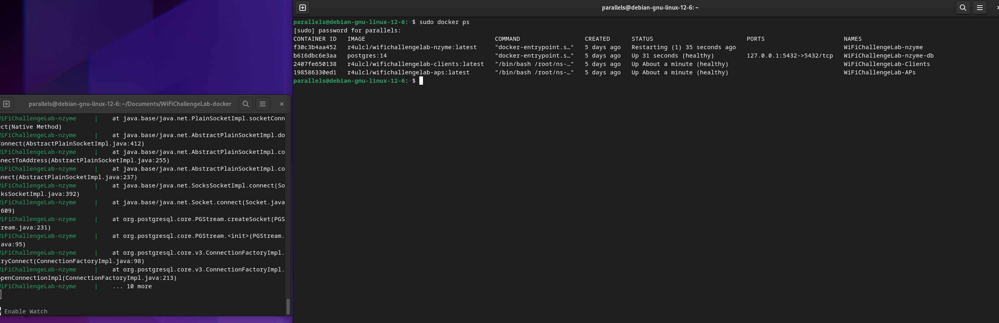
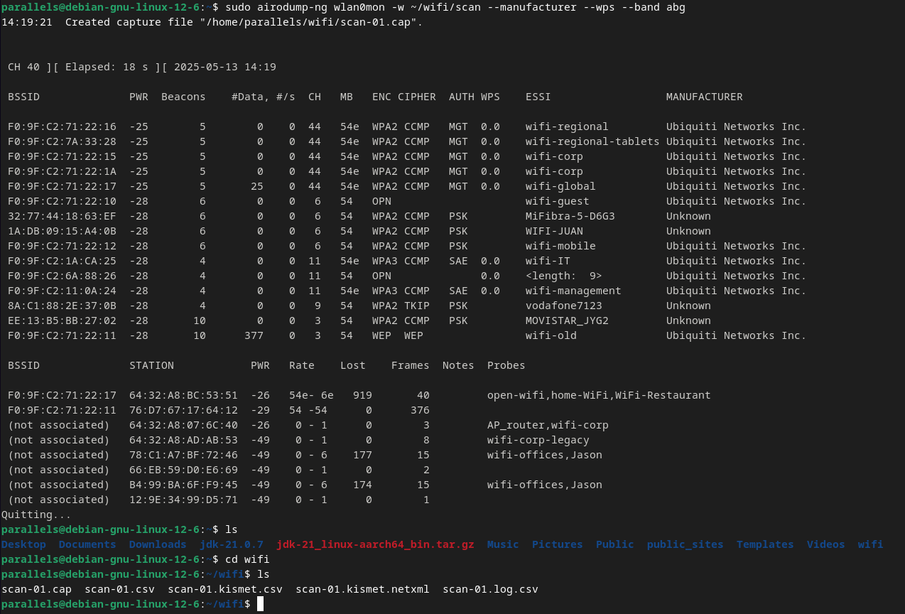

## h6 WiFi

Tehtävät ovat Tero Karvisen ja Lari Iso-Anttilan opintojaksolta [Verkkoon tunkeutuminen ja tiedustelu](https://terokarvinen.com/verkkoon-tunkeutuminen-ja-tiedustelu/) [^1], [^2].

---

### a) Tutustu wifi challenge lab 2.1 harjoitus ympäristöön ja käytä tarvittaessa hyväksesi jo olemassa olevia ohjeita.

Käytin dockeria labin asentamiseen:



Aloin käytmään WiFiLabin (vanhentuneen) walktroughin [^3] avulla tehtäviä läpi. Koska walktrough ei oikeastaan kerro tehtävistä juuri komentoja enempää kävin termejä läpi ja koitin ymmärtää mitä tehtävissä tapahtuu.

---

### b) Kirjoita raportti siitä mitä opit ja mitkä asia yllättivät sinut kun tutustuit harjoitukseen.


#### airmon-ng [^4]

- airmon-ng on osa **Aircrack-ng** suitea
- airmon-ng:tä täytetään Wi-Fi tiedusteluun.
- Tiedustelu airmon-ng:llä vaatii verkkokortin langattomalle verkolle, joka on asetettu monitor-tilaan.
- airmon-ng:llä pystyy passiivisesti monitoroimaan Wi-Fi liikennettä, kaappaamaan paketteja ja havaitsemaan haavoittuvuuksia verkossa.

#### Wi-Fi channel [^5]

- WiFi operoi pääsääntöisesti 2,4 GHz ja 5 GHz taajuuskaistoilla, jotka on jaettu omiin kanaviinsa.
- 2,4 GHz taajuuskaistalla on vähemmän kanavia kuin 5 GHz taajuuskaistalla.
- Kanavajako tehdään liikenteen sujuvoittamiseksi. Ruuhkainen liikenne (eli liika liikenne yhdellä kanavalla) aiheuttaa liikenteessä häiriöitä.
- Useat reitittimet tekevät kanavan valinnan automaattisesti.

#### airmon-ng käyttö

Ajatetaan seuraava komento (wlan0 on network interface, jolla tehdään monitorointi): 

```
sudo airmon-ng start wlan0
```

Ja tämän jälkeen nähdään, että käytössä on nyt `wlan0mon`.

```bash
72: wlan0mon: <BROADCAST,MULTICAST,UP,LOWER_UP> mtu 1500 qdisc mq state UNKNOWN group default qlen 1000
    link/ieee802.11/radiotap 02:00:00:00:00:00 brd ff:ff:ff:ff:ff:ff
```

Kuten walktroughissa tein kotihakemistoon kansion wifi ja kun ajaa seuraavan komennon, niin skannauksen tulokset ajetaan wifi kansioon:

```
sudo airodump-ng wlan0mon -w ~/wifi/scan --manufacturer --wps --band abg
```




Jos haluaa kohdistaa skannauksen vain yhteen kanavaan:

```
sudo airodump-ng wlan0mon -w ~/wifi/scanc11 --manufacturer --wps -c11
```

#### ESSID ja BSSID

- BSSID (Basic Service Set Identifier) ja ESSID (Extended Service Set Identifier) ovat liittymäpisteitä langattomaan verkkoon. [^6]
- ESSID on langattoman verkon nimi ihan kirjoitettuna esim "KotiWifi" ja BSSID on kirjoitettu tukiaseman laittoiston MAC-osoite esim "00:11:22:33:44:55". ChatGPT [^7]

---

#### c) Miten suhtautumisesi WLanin turvallisuuteen muuttui sen jälkeen kun teit harjoitukset?

Se mitä en ollut tullut tavallaan ajatelleeksi, vaikkakin asia on itsestään selvä, niin WLan tarjoaa jo puhtaasi luonteensa takia pinta-alaa erilaisille tiedusteluille ja hyökkäyksille. Tunnilla käyty tilanne, jossa WiFi:ssä olleet laitteet saatiin pakotettua irtautumaan verkosta ja yhdistymään siihen uudelleen tuntuu edelleen hurjalta.

Olen jo tähän asti käyttänyt reitittimessä ja WiFi:eissäni hyviä salasanoja ja näin tulen tekemään myös jatkossa. En juurikaan omista IoT-laitteita, ja nekin joita minulla on, olen aina kytkenyt parempaa suorituskykyä hakiessani johdolla. Jos jatkossa kytken jotain laitteita WiFiin, tulen tekemään sille oman verkon. En usko, että tulisin ainakaan ilman todella kattavaa selvitystä, kytkemään mitään kameraa langattomasti verkkoon. Lähtökohtaisesti en ostaisi sellasita kameraa, jota ei saa langallisesti verkkoon. 


---

## Lähteet

[^1]: Tero Karvinen. Verkkoon tunkeutuminen ja tiedustelu: https://terokarvinen.com/verkkoon-tunkeutuminen-ja-tiedustelu/

[^2]: Lari Iso Anttila. 5. Laboratorio- ja simulaatioympäristöt hyökkäyksissä, moodle: https://hhmoodle.haaga-helia.fi/course/view.php?id=42566&section=1#tabs-tree-start

[^3]: WiFiLab: Walkthrough WiFiChallenge Lab v2.0: https://r4ulcl.com/posts/walkthrough-wifichallenge-lab-2.0/

[^4]: S3Curiosity. Mastering Wi-Fi Reconnaissance with Airmon-NG: A Comprehensive Guide for Ethical Hackers: https://medium.com/@S3Curiosity/mastering-wi-fi-reconnaissance-with-airmon-ng-a-comprehensive-guide-for-ethical-hackers-6d792c6091f9

[^5]: Linksys. WiFi Channels - Tech Made Easy: https://www.youtube.com/watch?v=wJRt_buHHOc

[^6]: Wikipedia. SSID: https://fi.wikipedia.org/wiki/SSID 

[^7]: OpenAI. ChatGPT: Version 1.2025.112, Model GPT‑4o. "Can you explain ESSID and BSSID with few the sentences in Finnish, please?"