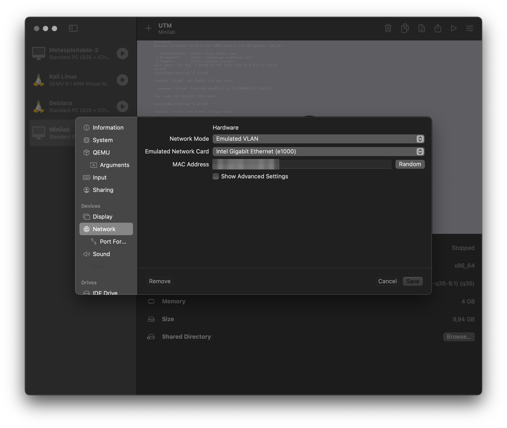
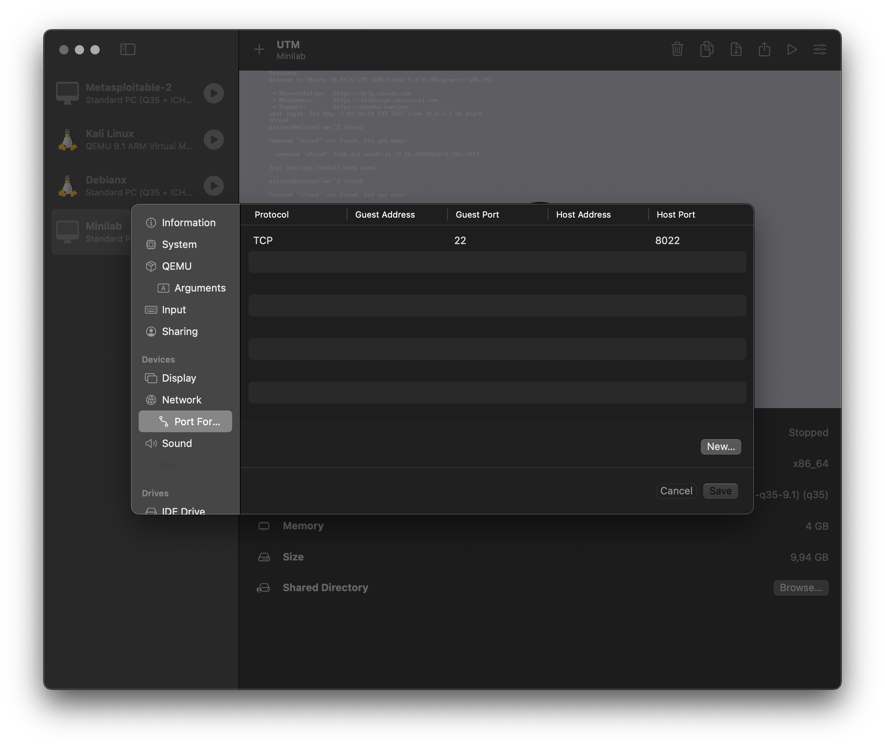
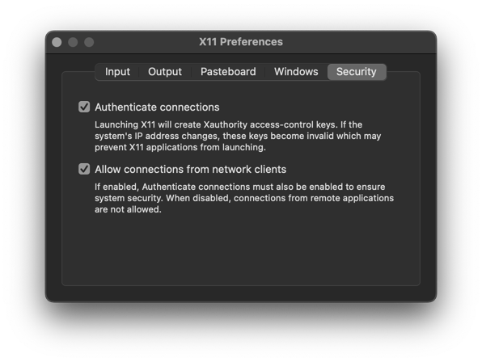
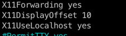

## Mininetin asennus ARM Mac

Itse sain mininetin tällä toimimaan, mutta muulla tavoin ohjeen toimivuudesta ei ole mitään takuita. 

### Alkuvalmisteluina tarvitaan

**UTM**

- https://mac.getutm.app [^1]

**QEMU**

```
brew install qemu
```

**XQuarzt** 

```
brew install --cask xquartz
```

<br>

**Virtuaalikoneen asennus UTM:llä**

- Virtuaalikoneen asentamisen voi tehdä samoin kuten tällä videolla: https://www.youtube.com/watch?v=E3IJ_d3rAgA [^2].

---

### Mininetin konfigurutointi

Jotta sain itse mininetin toimimaan tein seuraavaa:

Muutin UTM:n network asetuksista:





Ja XQuartz asetuksista:



Muista jättää XQuartz päälle. 

Mininettiin kirjautuminen komennolla:

```
ssh -Y -p 8022 mininet@127.0.0.1
```

Komennon `ehco $DISPLAY` pitäisi antaa suurinpiirtein tälläistä:

```bash
mininet@mininet-vm:~$ echo $DISPLAY
localhost:10.0
```

Itselläni komento ei antanut aluksi mitään, mutta kun käynnistin koneen uudelleen, tulostui yllä oleva `localhost:10.0` terminaaliin. En tiedä johtuuko siitä, että tuon XQuartz:n asetusten muutokset ei aktivoitunut ilman uudelleenkäynnistämistä?

Muutin myös mininet virtuaalikoneen `/etc/ssh/sshd_config` tiedostosta nämä rivit:



Ajoi Iso-Anttilan oheesta [^3] seuraavat komennot:

```bash
./get_xauth.sh #skripti Mininet vm:n kotihakemistossa
```

```bash
sudo -s xauth add mininet-vm/unix:10  MIT-MAGIC-COOKIE-1  d52b161e307d1c34bcbd8decb60fb95a #aiemman  komennon tuloste
```

Tässä selkeyden vuoksi koko sarja ja nyt XQuarzt avasi uuden terminaali-ikkunan.

```bash
mininet@mininet-vm:~$ ./get_xauth.sh
mininet-vm/unix:10  MIT-MAGIC-COOKIE-1  d52b161e307d1c34bcbd8decb60fb95a
mininet@mininet-vm:~$ sudo -s xauth add mininet-vm/unix:10  MIT-MAGIC-COOKIE-1  d52b161e307d1c34bcbd8decb60fb95a
mininet@mininet-vm:~$ cd lab/Network-Security-Lab/scripts/
mininet@mininet-vm:~/lab/Network-Security-Lab/scripts$ sudo python hub_topo.py
*** Creating nodes
*** Creating Links
*** Starting network
*** Configuring hosts
h1 h2 h3 h4
disable ipv6
disable ipv6
disable ipv6
disable ipv6
disable ipv6
*** Running CLI
*** Starting CLI:
mininet> xterm h1
mininet>
```


---

### Lähteet

[^1]: UTM: https://mac.getutm.app

[^2]: Cybercat Labs. How to install Metasploitable on a Macbook with an M1 Chip: https://www.youtube.com/watch?v=E3IJ_d3rAgA

[^3]: Lari Iso-Anttila: https://hhmoodle.haaga-helia.fi/pluginfile.php/4252431/mod_resource/content/1/03-mininet.pdf